# Mini and regional airliner: model, cabin and seats

This file describes the two airliners as built: the render model, the cabins, how a player boards a seat by
clicking, and the hitboxes that make the nose and tail clickable. There are two sizes of one design:

- the **mini airliner** (`simpleplanes:airliner`, `AirlinerEntity`): 3.625 blocks wide, 22 seats, two by two
  either side of the aisle;
- the **regional airliner** (`simpleplanes:regional_airliner`, `RegionalAirlinerEntity extends
  AirlinerEntity`): 2.5 blocks wide, 14 seats, one either side of the aisle. It is lighter and a little more
  agile; its numbers are in `design/DESIGN.md` section 4.4.

The mini airliner's flight model is in `design/DESIGN.md` section 4 and is unchanged by the cabin work and by
the second size. Everything below applies to both sizes unless a size is named; the mini airliner's values
are given first.

| Layer | Class | Texture (mini / regional) | Render type | Cubes (mini / regional) |
|---|---|---|---|---|
| material, wooden version | `client/render/models/AirlinerModel` | `state.materialTexture` (the block texture, tiled 16x16, same as `PlaneModel`) | `entityCutoutCull` | 72 / 74 |
| material, metal version | `client/render/models/AirlinerSkinModel` | `plane_upgrades/airliner_skin.png` (1024x1024) / `regional_airliner_skin.png` (512x1024) | `entityCutoutCull` | 72 / 74 |
| metal, seats included | `client/render/models/AirlinerMetalModel` | `plane_upgrades/airliner_metal.png` / `regional_airliner_metal.png` (256x256 each) | `entityCutoutCull` | 119 / 95 (109 / 85 drawn: one logo of six is visible) |
| fans (propeller slot) | `client/render/models/AirlinerFanModel` | the size's metal texture | `entityCutout` (default, two-sided) | 10 |

A material layer, the metal layer and the fans make 191 drawn cubes on the mini airliner (66 of them the
seats) and 169 on the regional (42 seats). For comparison: large plane 157, cargo plane 297.

**Shared code.** One set of classes builds both sizes:

- `entities/AirlinerLayout` (`WIDE`, `REGIONAL`): the seats, the hull box that clicks are traced to and the
  hitbox stations, used by the entity and by the model's seat cubes;
- `client/render/models/AirlinerShape` (`WIDE`, `REGIONAL`): every model dimension that differs between the
  sizes (half width, body length, rounding steps, windows, nose, tail cone, wings, stabilisers, engines,
  winglets, gear, windscreen, window belt and doors), the textures and the UV tables. `AirlinerAirframe`,
  `AirlinerMetalModel` and `AirlinerFanModel` take one as their argument; the cross-section heights, the
  cockpit, the fin, the logos and the seat shapes are the same for both;
- `client/render/models/AirlinerUv`: the generated `texOffs` tables of both sizes (see *Textures*);
- `AirlinerRenderer` takes the shape; `PlanesModelLayers.registerAirliner` registers the four layers and the
  renderer of one size.

The two sizes differ only by these data and by `RegionalAirlinerEntity`'s physics numbers.

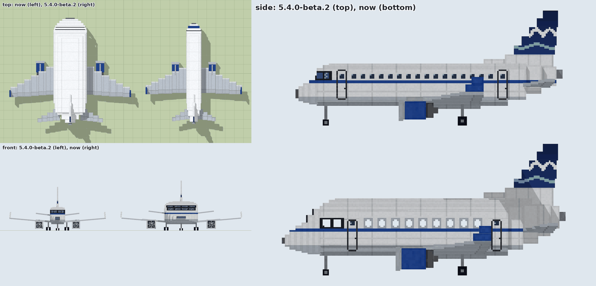

## Two sizes

| | mini airliner | regional airliner |
|---|---|---|
| seats | 22: 2 crew + 5 rows of 2+2 | 14: 2 crew + 6 rows of 1+1 |
| fuselage width x height | 3.625 x 2.375 (58 x 38 px) | 2.5 x 2.375 (40 x 38 px) |
| length, APU cone to nose tip | 11.69 | 11.94 (the body is 4 px longer) |
| wingspan, winglets included | 13.19 | 9.95 |
| stabiliser span | 7.1 | 5.5 |
| height to the fin tip | 5.44 | 5.44 |
| cabin floor / ceiling | 1.0 / 2.875 | same |
| engine fan centre | (±3.25, 0.69, 1.25), nacelles 14 px | (±2.375, 0.75, 1.0), nacelles 12 px |
| wheelbase / main-gear track | 5.625 / 3.25 | 5.375 / 2.25 |
| windows per side | 2 cockpit + 9 cabin | 2 cockpit + 11 cabin |
| entity bounding box | `sized(3.0, 2.6)` | `sized(2.2, 2.6)` |
| hitbox entities | 4 x `airliner_part`, 3.4 x 3.3, at z +4.5, +1.5, -1.5, -4.5 | 4 x `regional_airliner_part`, 2.6 x 3.3, at z +4.75, +2.25, -2.25, -4.75 |
| tail-strike angle / ground pitch clamp | 14.5 / 12 deg | 13.4 / 12 deg |
| recipe (plane workbench) | 4 propellers + 12 material | 2 propellers + 9 material |
| collision mass | 1.6 | 1.3 |

The regional's cross-section is the mini airliner's with every half width scaled to about 0.7 (walls 20 px,
shoulders 17, crown 14 and 9, keel 13), so the heights, the cockpit floor, the window band and the crew's eye
are unchanged. Six rows at a 17 px pitch need a body 4 px longer; the tail cone, fin, stabilisers and logos
move back by those 4 px (`AirlinerShape.tailShift()`). The wings keep the same chord steps scaled down
(root chord 39 px, five steps instead of six), the engines are 12 px nacelles 38 px out, and the gear
track follows the narrower belly. Both come in the same two finishes (oak or metal skin by material tag)
with the same six logos.

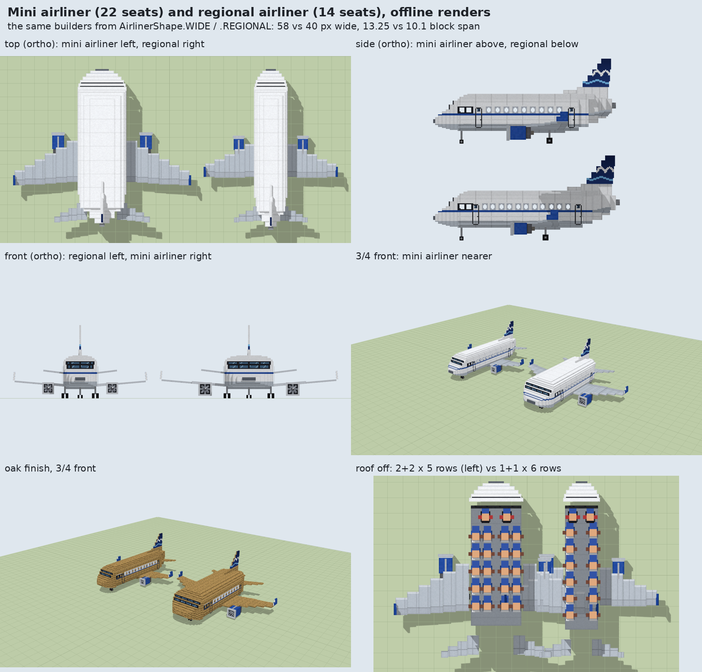
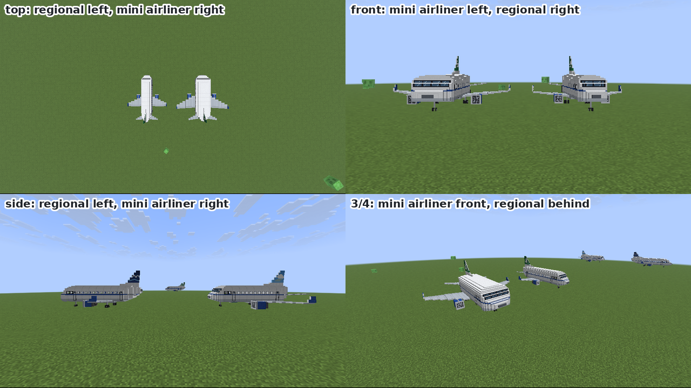
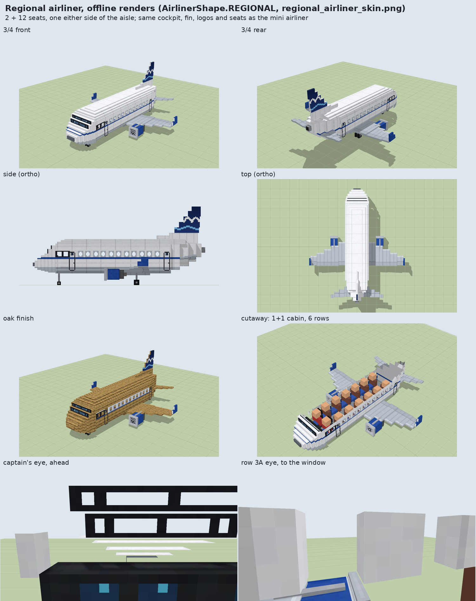

## Coordinates

### Model space

Model space is in pixels, where 1 px = 1/16 block. It uses the usual `ModelPart` convention: +Y points
down and the nose points to -Z. +X is the aircraft's left side.

- `AirlinerModel` and `AirlinerSkinModel` (both built by `AirlinerAirframe`) hang everything off the part
  `Airliner`, `AirlinerMetalModel` off `Metal` and `AirlinerFanModel` off `Fans`. All three are at
  `PartPose.offset(0, 24, 0)`, so their local frames match. In that local frame:
  - the ground contact (the bottom of every tyre) is at **y = 0**;
  - the keel is at y = -13, the belly fairing under the wing at y = -11, the cabin floor at y = -16, the
    cabin ceiling at y = -46, the crown at y = -51 and the fin tip at y = -87;
  - the window band (the windows' sill and lintel) runs from y = -32 to y = -37;
  - the nose tip is at z = -103 and the end of the APU cone at z = +84.
- The wings, stabilisers and winglets are children with a dihedral roll: `wing_left`/`winglet_left` pivot at
  (28, -14, 0) with `zRot = -AirlinerAirframe.WING_DIHEDRAL` (0.0873), `wing_right`/`winglet_right` at
  (-28, -14, 0) with `+WING_DIHEDRAL`; `stab_left`/`stab_right` pivot at (±18, -28, 0) with `∓STAB_DIHEDRAL`
  (0.1222).
- The fans pivot at local (±52, -11, -26), the nacelle axis, 2 px behind the front of the intake ring
  (regional: (±38, -12, -22)).
- The regional airliner's wings pivot at (±19, -14, 0) and its stabilisers at (±11, -28, 0), with the same
  dihedrals.

### Entity space

Entity space is in blocks, with +Y up and the nose at +Z. `PlaneRenderer.submit` uses the per-type
translate `(0, -0.025, 0.375)` for the airliner, so a model point at local `(x, y, z)` (relative to the
y = 24 root) ends up at

```
entity = ( x/16 ,  -y/16 ,  -(6 + z)/16 )
```

The renderer rotates the plane about entity point (0, 0.375, 0), because the quaternion comes before the
per-type translate. `AirlinerLayout.x/y/z(seat)` use the same mapping. The regional airliner uses the same
translate.

## Dimensions of the mini airliner, before and after the cabin

| | before (5.4.0-beta.2) | now |
|---|---|---|
| fuselage width x height | 1.625 x 1.75 | **3.625 x 2.375** (58 x 38 px) |
| length, APU cone to nose tip | 11.0 | **11.69** (nose tip z +6.06, APU end z -5.63) |
| wingspan, winglets included | 10.47 | **13.19** |
| height to the fin tip | 4.75 | **5.44** |
| top of the fuselage (crown) | 2.56 | 3.19 |
| belly above the ground | 0.81 (0.69 under the wing fairing) | unchanged |
| cabin floor / ceiling | 1.0 / 2.375 | 1.0 / 2.875 |
| engine fan centre | (±2.0, 0.625, 1.125) | (±3.25, 0.69, 1.25); nacelles 14 px (12 before) |
| wheelbase / main-gear track | 5.625 / 2.0 | 5.625 / 3.25 |
| stabiliser span | 4.75 | 7.1 |
| seats | 6 in one column | **22**: 2 crew, 20 passengers two by two |

The fuselage is 2 blocks wider, as asked, and 0.63 block taller so the cross-section stays rounded (flat sides
between two stepped shoulders above and two below). The wings keep their shape and move out with the
fuselage side, with a slightly longer root chord (49 px, was 44); the engines move out to stay clear of the
wider fuselage and grow by 2 px; the stabilisers grow with the wider tail cone; the fin rises with the crown.
The length grows by 0.69 block: the nose got two more steps to taper from the wider section, and the tail
cone one. The keel end, which sets the tail-strike angle, is where it was (entity y 0.8125, z -3.25), so the
14.5 deg tail-strike angle and the 12 deg ground pitch clamp still hold.

Nothing in the flight changes: the physics numbers, the mass, the entity bounding box (`sized(3.0, 2.6)`) and
the per-type translate are as before. Measured on the server with the same procedure on the old and the new
jar, take-off, cruise and turn are identical to the digit (see `design/DESIGN.md` section 4.2).

## Hitboxes and boarding by click

The airliner's own bounding box is `sized(3.0, 2.6)`, the mod's convention for big airframes and what the
physics collides with. It covers only the middle 3 blocks of an 11.7 block aircraft, so the nose, the
cockpit and the tail could not be clicked, and vanilla's range checks (client and server) are made against
the bounding box of the entity clicked.

**The fix: four hitbox entities along the fuselage** (`entities/AirlinerPartEntity`, type
`simpleplanes:airliner_part`, `sized(3.4, 3.3)`), at entity z +4.5, +1.5, -1.5 and -4.5
(`AirlinerLayout.partStation`), together covering the fuselage from the nose tip to the APU. The regional
airliner has four narrower ones (`simpleplanes:regional_airliner_part`, `sized(2.6, 3.3)`) at z +4.75,
+2.25, -2.25 and -4.75, 2.6 blocks long each, from the nose tip (+6.06) to the APU (-5.88); the entity
picks its type through `AirlinerEntity.partType()`:

- the airliner spawns them on its first server tick and removes them in `onRemoval`; they are never saved
  (`noSave`), not summonable, fire-immune, and a part whose airliner is gone for 20 ticks removes itself;
- both sides move them every tick to `AirlinerEntity.partPosition(station)`, the station rotated with the
  airliner, so they follow it in flight without waiting for a server update (their own update interval is
  10 ticks);
- they are invisible (`NoopRenderer`), have no physics, do not collide (`canBeCollidedWith` false), are not
  pushable and ignore explosions;
- a click on a part calls the airliner's `interact` with the hit location moved into the airliner's frame;
  a hit (an attack, an arrow) is passed to the airliner's `hurtServer`, except explosions, which the airliner
  receives itself;
- `canBePickedFromInside` is false and, on the client, a part is not pickable for the local player riding its
  airliner, so riders aim at the world rather than at their own aircraft.

**Choosing the seat.** `AirlinerEntity.interact` works out the clicked point in the airliner's frame and
boards the player into:

- the captain's seat (seat 0, the pilot) when the point is on the cockpit or the nose (entity z >= 3.25,
  regional 3.3125, `AirlinerLayout.cockpitZ()`) and the seat is free;
- otherwise the free seat nearest to the point (distance in x and z), so a click on a window boards the seat
  next to it and a click on the tail a seat in the last row. With the captain's seat taken, a cockpit click
  boards the first officer's seat if it is free.

The clicked point comes from the player's eye ray traced to the fuselage's box on the server (half width
1.8125, regional 1.25; belly 0.8125 to crown 3.1875; nose tip +6.0625 to tail -5.625, regional -5.875); the hit
location the client sends (where its pick ray entered the part's or the airliner's bounding box, up to a
block off the skin when the airliner is not axis-aligned) is used when the ray misses or lands more than 2
blocks from it. A player who boards is turned to face the nose (`forceSetRotation`), as vanilla does for
boats.

**Options weighed.**

| option | why not |
|---|---|
| a larger `getPickRadius()`, rejecting clicks outside the fuselage | the inflated box is a cube around the middle: to reach the cockpit it would be about 11 blocks on each side. It would catch every click and arrow in that volume, block targeting blocks and mobs near a parked airliner, and projectiles use the same radius. Vanilla's range checks still use the real bounding box, so a survival player (3 block reach) could not click the cockpit anyway. |
| a larger or rotating bounding box | the box is axis-aligned and is what the plane collides with: 11 blocks long at a diagonal heading is an 8 x 8 invisible wall, and a change to the physics |
| vanilla `Interaction` entities | only record the last click for polling, would have to ride the airliner (and so fill its passenger list) to follow it, and give no hit location in the airliner's frame |
| a mixin on picking | not allowed |

The hitbox entities cost four entities per airliner, one small spawn packet each and nothing per tick while
parked. Their boxes are axis-aligned, so at a diagonal heading their corners reach up to about 0.7 block
beyond the skin, where a click still boards and a block behind cannot be targeted. They do not change the
flight, collisions or what an arrow hits in the middle.

## Seats

Mini airliner: twenty-two seats, laid out in `AirlinerLayout.WIDE` (feet points in entity blocks, model px in
brackets):

| seat | role | x | y | z |
|---|---|---|---|---|
| 0 | captain, the pilot; players only | +0.6875 (11) | 0.6875 | +3.75 (-66) |
| 1 | first officer; anyone, villagers once the cabin is full | -0.6875 (-11) | 0.6875 | +3.75 (-66) |
| 2-5 | row 1, A B C D | +1.3125, +0.5625, -0.5625, -1.3125 (21, 9, -9, -21) | 0.5625 | +2.5 (-46) |
| 6-9 | row 2 | as row 1 | 0.5625 | +1.375 (-28) |
| 10-13 | row 3 | as row 1 | 0.5625 | +0.25 (-10) |
| 14-17 | row 4 | as row 1 | 0.5625 | -0.875 (8) |
| 18-21 | row 5 | as row 1 | 0.5625 | -2.0 (26) |

Rows are 18 px (1.125 blocks) apart, two seats either side of an 8 px aisle. A is the left window seat.

Regional airliner: fourteen seats, `AirlinerLayout.REGIONAL`:

| seat | role | x | y | z |
|---|---|---|---|---|
| 0 | captain, the pilot; players only | +0.5625 (9) | 0.6875 | +3.75 (-66) |
| 1 | first officer; anyone, villagers once the cabin is full | -0.5625 (-9) | 0.6875 | +3.75 (-66) |
| 2-3 | row 1, A B | +0.75, -0.75 (12, -12) | 0.5625 | +2.75 (-50) |
| 4-5 | row 2 | as row 1 | 0.5625 | +1.6875 (-33) |
| 6-7 | row 3 | as row 1 | 0.5625 | +0.625 (-16) |
| 8-9 | row 4 | as row 1 | 0.5625 | -0.4375 (1) |
| 10-11 | row 5 | as row 1 | 0.5625 | -1.5 (18) |
| 12-13 | row 6 | as row 1 | 0.5625 | -2.5625 (35) |

Rows are 17 px (1.06 blocks) apart, one 10 px seat either side of a 14 px aisle, 3 px from the wall. A is
the left window seat, B the right. The entity defines 22 synched seat slots for both sizes
(`AirlinerLayout.MAX_SEATS`); the regional uses the first 14.

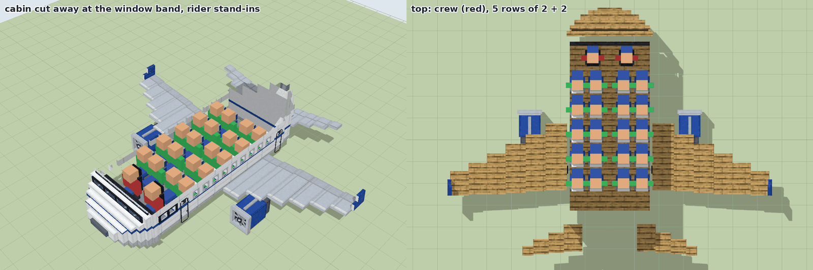

- **Seat models.** Every seat is a cushion, a back and a headrest in the metal layer (blue cloth with a grey
  shell and a white headrest cover in the cabin, black leather for the crew). The crew seats stand 2 px
  higher so that their eye is in the lower windscreen's panes.
- **Rider geometry** (seated player model at 15/16 scale): hips 11.25 px above the feet point, on the
  cushion; head 22.5 to 30 px above it, under the 46 px ceiling. Vanilla's eye is at feet + 1.62 (cabin
  2.18, crew 2.31); with the mod's `CameraMixin` the first-person camera is at feet + 1.695 (cabin 2.26,
  crew 2.38). Both are inside the window band (2.0 to 2.31) in the cabin, and in the lower windscreen's pane
  row (2.25 to 2.44) in the cockpit.
- **Own seat.** `AirlinerRenderer` puts the seat of the first-person camera's entity into
  `PlaneRenderState.airlinerHiddenSeat`, and `AirlinerMetalModel.setupAnim` hides that seat's back and
  headrest (each seat's back is a part of its own), so a rider looking round does not face the inside of his
  own headrest. The cushion stays. In third person everything is drawn.

**Assignment.** A seat belongs to a rider, not to a place in the passenger list:

- each seat is a synched int (`AirlinerEntity.SEATS`) holding the rider's entity id, or -1. The server
  assigns it in `addPassenger` and clears it in `removePassenger`; `positionRider` places every rider by
  `seatOf(rider)` on both sides, so server and client always agree, and nobody moves when someone else leaves;
- a player takes the seat chosen by his click; without a click (`/ride`, a reconnect) the captain's seat if it
  is free, else the front-most free cabin seat, else the first officer's. Anything that is not a player
  (a villager, another mob) may take any seat but the captain's: the front-most free cabin seat, and the
  first officer's once the cabin is full, so it stays free for a player as long as possible. 21 villagers
  (13 in the regional) fill the aircraft and the captain's seat stays free for the pilot;
- `getControllingPassenger()` is the player in the captain's seat, or nobody. A villager in the first
  officer's seat never controls, nor does anyone while the captain's seat is empty. A player in any other seat
  is a passenger: his client is not authoritative and his keys do not fly the aircraft. The autopilot rule is
  unchanged (nobody controls while the flight director flies);
- the world save keeps the seats as a `Seats` list of `{UUID, Seat}`; a rider who comes back (a chunk
  reload, a server restart, a player reconnecting with the airliner as his vehicle) gets his seat back. The
  item made from an airliner drops the list, as it drops the throttle. An airliner saved by an older build
  has no list, and its riders take the default seats.

**What changed from the six-seat version, and why the rider "sat in the centre".** In 5.4.0-beta.2 the
seat was the passenger's index in the vanilla passenger list (+1 without a player aboard), and a player
clicking anywhere always got seat 0, the pilot's, 4.25 blocks forward on the centre line. That mapping was
consistent: measured on a real client, the pilot's feet were at the same point on the server (a marker
summoned at the rider) and on the client (F3), (7.875, -18.625, 13.681) for an airliner at (10, -19, 10)
heading 30. The screenshot that looked like a mid-cabin seat was the pilot's seat seen looking aft: the
player keeps his own yaw when he boards, the walls are see-through from inside and the cockpit had no seats
or windows to show where he was, so what he saw was the long floor, the wings and the engines. The dark band
across the view was the old windscreen box's top face, 0.1 px below the `CameraMixin` eye and seen edge on.
Riders now face the nose when they board, sit in visible seats, and the windscreen is a frame ahead of the
crew.

## Windows, windscreen and the view out

The fuselage stays see-through from inside, and it now has real openings.

- **Culling.** The material layers and the metal layer are `entityCutoutCull`. The default `entityCutout`
  does not cull, and every rider would see the inside of the walls. `AirlinerFanModel` keeps the default
  (no eye is inside it).
- **The body is split around the window band.** `body_lower` (y -32 to -20) and `body_upper` (y -43 to -37)
  are full-width boxes with the faces a rider would see from inside left out (`CubeListBuilder.addBox(...,
  Set<Direction>)`): the top of the lower one, the underside of the upper one, and the upper one's front,
  where the windscreen is. `hull_low` and `hull_high` round the section off with the same omissions, so the
  floor a rider sees is the lower shoulder's top (y -16) and the ceiling the upper shoulder's underside
  (y -46). All other faces around a rider point outwards and are culled from inside.
- **Window band.** Between y -37 and -32 each side is a row of pillars (`pillar_0` to `pillar_11`, regional
  `pillar_13`, 2 px thick or more) with the openings between them: two cockpit windows and nine cabin windows
  (regional eleven), 4 px wide, one on each seat row and one between rows (`AirlinerShape.windows`). From outside you see the seats and their riders through
  the windows and, through the far wall, the world beyond; from inside the pillars frame the windows at eye
  level. The metal layer's window belt is a white plate over the band with open windows (rounded corners
  painted in), a light gasket and the blue cheat line under it; its inner faces are transparent.
- **Windscreen.** The nose steps down and forward in seven boxes that have no back face, so the crew see through
  the nose. Two tinted, opaque windscreen plates sit on the fronts of the first two steps; their face towards
  the crew is the same black frame with the panes open, so the crew look out through a windscreen frame, over
  the instrument panel (screens and annunciators on its crew side). The cockpit side windows are open.

## Animated parts: the fans

`AirlinerFanModel` goes into the renderer's **propeller** slot with the size's metal texture. Parts, children of
`Fans`: `fan_left` and `fan_right`, each a spinner cube with a white spiral mark and four crossed blade bars
(12 px, was 10; regional 10 px: the blade span is the nacelle size less 2), `blades_0` to `blades_3`, at 45° steps, each twisted 0.5 rad: eight blades per fan.
`setupAnim` sets `fanLeft.zRot = fanRight.zRot = state.propellerRotation`. The fans sit 2 px inside open
intake rings; the cowl's front face behind them is painted as the dark fan case.

## Wood or metal: the two material layers

- **wooden**: `AirlinerModel`, textured with the plane's material block texture, tiled like every other plane
  (`LayerDefinition.create(mesh, 16, 16)`); `WOOD_UV` only picks which part of the plank pattern shows;
- **metal**: `AirlinerSkinModel`, textured with its own `airliner_skin.png` (regional
  `regional_airliner_skin.png`), a white-and-aluminium livery:
  white upper fuselage and fin, a blue cheat line that continues the window belt's round the nose and the
  tail, an aluminium belly, wings and stabilisers, a grey radome, panel joints every block, and flap, aileron,
  hinge and leading-edge lines on the wings.

The geometry lives once, in `AirlinerAirframe.create(AirlinerShape, UvLayout)`; each layer supplies a table of
`texOffs` per named cube, and a cube missing from either table fails at bake time with "no texOffs for airliner cube ...".
The right-hand pillars, wing and stabiliser steps reuse their left-hand twin's net. The metal layer and the
fans are the same for both finishes. The finish is chosen per aircraft by material: a block in
`simpleplanes:airliner_metal_skin` (iron, copper, waxed copper, gold, netherite) gives the metal skin.

## Airline logos

The fin carries one of six **fictional** airline logos. The names and marks are invented for this model;
none depicts or imitates a real airline or manufacturer.

| index | name | tail |
|---|---|---|
| 0 | Terntide | navy, a white gliding tern and a pale-blue wave |
| 1 | Glimmerwing | deep violet, two swept teal and green ribbons, a four-point star |
| 2 | Pinewind | forest green, a white three-tier pine and a wind streak |
| 3 | Puffcloud Express | sky blue, a big white cloud and two yellow speed lines |
| 4 | Coralline | white, three coral, orange and red bands parallel to the swept leading edge |
| 5 | Marigold Hop | marigold yellow, a rust six-petal flower |

`AirlinerMetalModel` has six parts `Tail/logo_0` to `logo_5`, each a pair of flush plates on the fin's upper
five steps (local y -87 to -58, z 50 to 79), transparent outside the fin's outline. `setLogo(int)` shows one
(modulo `LOGO_COUNT`); `setupAnim` calls it with `state.airlinerLogo`. The entity rolls the logo when it is
created on the server, syncs it (`LOGO`), saves it as `Logo` and keeps it in the item.

## Textures

- `airliner_skin.png`: 1024x1024 RGBA (it was 512x512; the wider fuselage's nets no longer fit), the net of
  every airframe cube for `AirlinerSkinModel`, painted by model position. `regional_airliner_skin.png`:
  512x1024, the same for the regional's airframe.
- `airliner_metal.png`: 256x256 RGBA, the nets of every metal and fan cube: the windscreen mask and tinted
  panes, the instrument panel, the cockpit side-window plates, the window belt with open windows, the doors,
  the seats (cloth, shell, headrest cover, crew leather), the six logos, nacelles, winglets, pylons, gear,
  APU, blades and spinner. `regional_airliner_metal.png`: 256x256, the same parts at the regional's sizes.
- All four are generated procedurally (original work) by scripts kept outside the repository. The scripts
  read the cube list from the model builders themselves (a recording `UvLayout`), pack the nets, paint them
  and write the tables `WIDE_METAL`, `WIDE_SKIN`, `REGIONAL_METAL` and `REGIONAL_SKIN` (with the skin
  texture sizes) between `@UV-BEGIN <name>` and `@UV-END <name>` in `AirlinerUv`; `AirlinerFanModel` reads
  the metal table too. The mini airliner's textures and tables regenerate byte-identical. Hand edits are
  fine; a moved `texOffs` needs the texture repainted to match.

## Parts

`AirlinerModel` and `AirlinerSkinModel` > `Airliner` (built by `AirlinerAirframe`):

- `Fuselage`: `body_lower`, `body_upper`, `hull_low`, `hull_high`, upper and lower shoulders, the crown in two
  steps, the keel and the belly fairing under the wing root.
- `WindowBand`: `pillar_0` to `pillar_11` (regional `pillar_13`) on each side.
- `Nose`: `nose_1` to `nose_7`, the windscreen steps down to the radome.
- `TailCone`: four steps; the top stays level while the belly sweeps up to the APU.
- `wing_left`, `wing_right`: six chord steps each (regional five); `stab_left`, `stab_right`: four; `Fin`: a
  dorsal fillet and six swept steps.

`AirlinerMetalModel` > `Metal`:

- `Cockpit`: the two windscreen plates, the instrument panel, the cockpit side-window plates.
- `Cabin`: both window belts, front and rear doors on both sides.
- `Seats`: the 22 cushions (regional 14), and `seat_0` to `seat_21` (`seat_13`), each seat's back and
  headrest.
- `engine_left`, `engine_right`: intake ring (4), cowl, exhaust, plug, pylon.
- `winglet_left`, `winglet_right`: two cubes each, on the wing pivots.
- `Tail`: the APU cone and `logo_0` to `logo_5`.
- `Gear`: nose strut and twin nose tyres; two main struts, each with two tyres.

## Test commands

`/airliner`, permission level 2, works from the console; every line also goes to the log at INFO (logger
`simpleplanes-airliner`). `<id>` is the entity id, as printed by `aircraft spawn` or `airliner status`. Every
subcommand works on both sizes; `/aircraft spawn regional_airliner <x y z> [heading]` spawns the regional
(`/aircraft` also accepts it in `status`, `takeoff`, `launch`, `hold` and the rest, and prints its skin and
logo as for the mini airliner; `AircraftType.REGIONAL_AIRLINER` makes it available to `/autopilot ... type
regional_airliner`).

| syntax | effect | example |
|---|---|---|
| `airliner status` | one line per airliner of either size in loaded chunks: `#id <type> logo= item-logo= skin= riders=<n>/<seats> seats=[<seat>@<x>/<z>,...] pilot=<name\|none> parts=<n> pos= spd= pitch= og= thr= health=`. `<type>` is `airliner` or `regional_airliner`; `seats` lists each rider's seat and where his feet are in the airliner's frame (blocks, +x left, +z towards the nose); `pilot` is the controlling passenger; `parts` the hitbox entities found around it (4) | `airliner status` |
| `airliner board <id>` | mounts every villager within 8 b that is not riding, nearest first, through the normal `startRiding`; prints the seat each one got (`seat 2 (row 1A)`, `seat 1 (first officer)` once the cabin is full) or that it was refused (only the captain's seat left, or none) | `airliner board 48` |
| `airliner click <id> <x> <y> <z>` | added with the cabin. A dry run: prints the seat a player clicking the airliner-frame point (x, y, z) would board, e.g. `boards seat 0 (captain)` | `airliner click 48 0 2 5.8` |
| `airliner click <id> <x> <y> <z> <player>` | added with the cabin. Runs the airliner's own `interact` for an online player with that point as the hit location, as a real click does (the eye ray is used only if it lands within 2 blocks of the point), and prints the result, the seat and whether the player now controls the airliner | `airliner click 48 1.8 2.2 0.3 Tester` |
| `airliner logo <id> <0..5>` | sets the synched logo | `airliner logo 48 4` |

## Limitations

- Riders see out through the walls, not only through the windows; onlookers looking in through a window see
  the far side of the cabin open to the outside behind the seats and pillars.
- The windscreen panes are opaque from outside (tinted glass); the crew are seen through the cockpit side
  windows.
- The hitbox entities are axis-aligned, so at a diagonal heading their corners stick out up to about 0.7 block
  past the skin.
- Player shoulders are 15 px wide and the mini airliner's seats 12 px apart, so neighbours' arms overlap a
  little, as they do on vanilla's multi-seat vehicles (the regional's are 24 px apart).
- **Upgrade models.** `UpgradesModels` draws nothing for either airliner (`hasNoUpgradeVisuals`), as before.

Screenshots from a real 26.3 client (Mesa llvmpipe under Xvfb) joined to a test server, mini airliner:

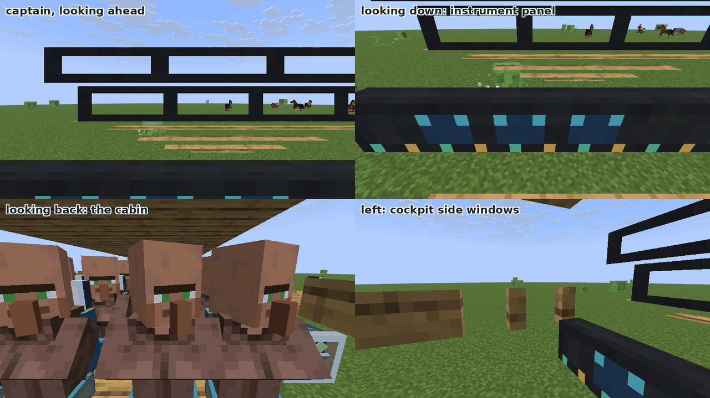
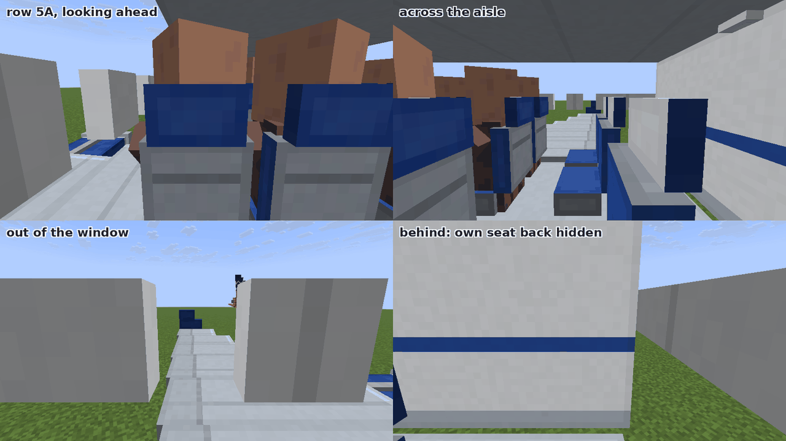
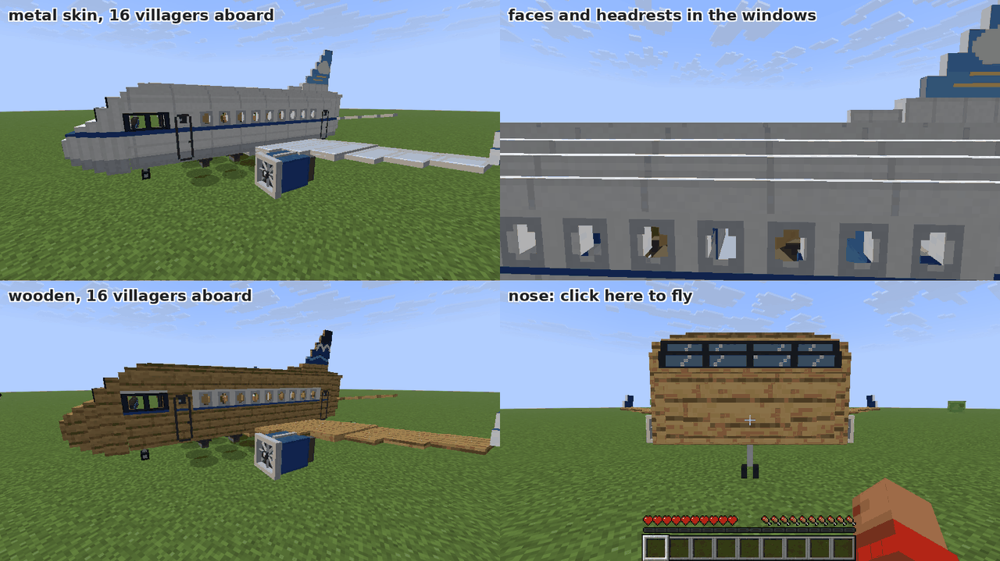

Regional airliner:

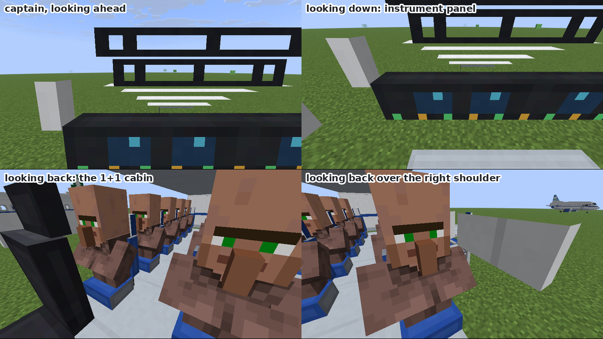
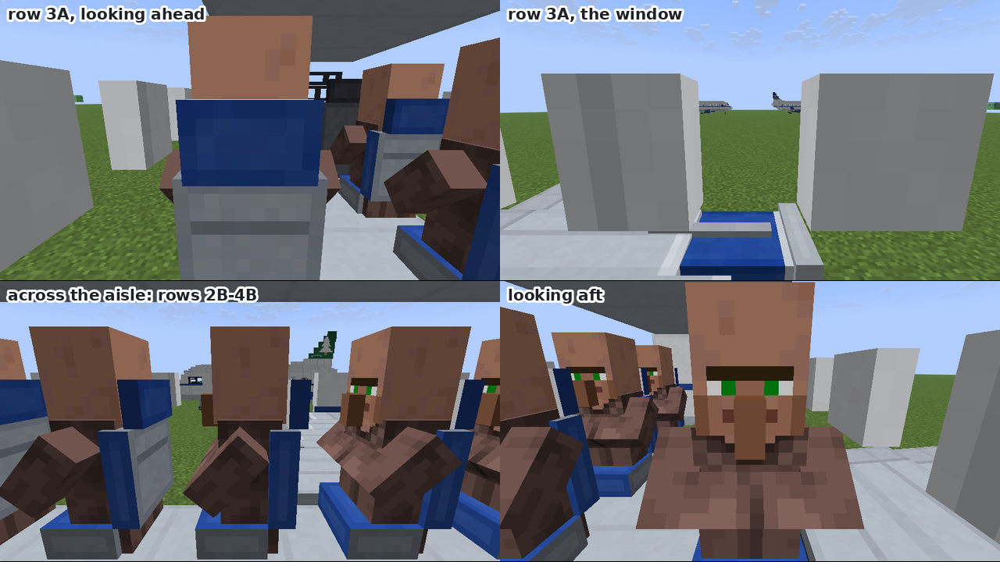
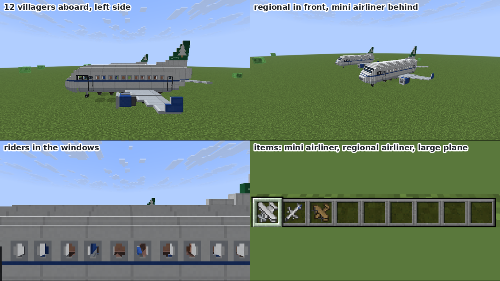
