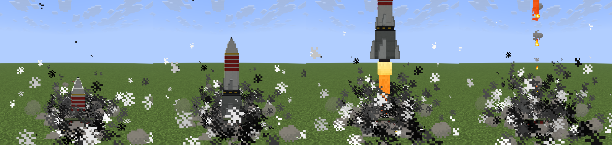
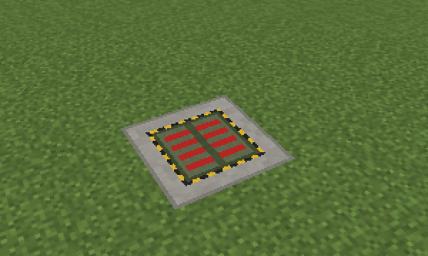
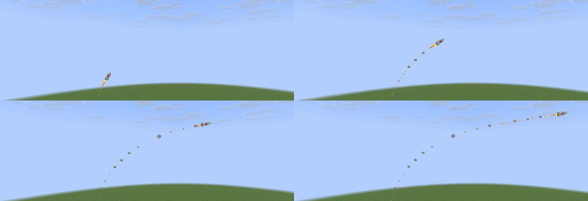

# Missiles and launch silos

Ground-launched missiles in four tiers, fired from silos sunk into the ground. A missile rises out of its
silo with its fins folded, deploys them clear of the tube, turns toward the target, cruises and dives on it.

**Phase 2 (this build)** adds two things:

- **The silo item** (§1a). One item, `simpleplanes:launch_silo`, builds a tier 1 silo, and each further item
  used on the silo raises it one tier, up to 4. Breaking it gives back one item per tier and puts the ground back.
- **Warheads** (§1b). A missile that arrives, or hits terrain on the way, detonates with a blast that depends on
  its tier, up to `Blast.MAX_POWER` for tier 4. Every detonation goes through `Blast#detonate`, the same path
  as the strike aircraft, so blast guards (claims, protection) apply to missiles exactly as to aircraft. The game
  rule `simpleplanes:missile_explosions` (default `true`) switches warheads off and restores the phase 1
  behaviour: a puff of smoke and particles, nothing broken, nobody hurt.

**Phase 3 (this build)** adds **air defence** (§1c):

- A silo switches between **strike** and **air defence** with a right-click, empty-handed or with any item except
  the silo item and the missile items.
- Aircraft (every `PlaneEntity`) get a **friendly/hostile allegiance**, chosen when they are spawned. It can be set
  from `/summon`, the plane item, the autopilot, the shuttle dispatcher and the gunship command.
- An AD silo with a loaded missile launches at the **nearest hostile aircraft** within its tier's detection
  radius. The missile **pursues** it and ends in a **proximity detonation** with the tier's warhead, through the
  same `Blast#detonate` path as everything else.
- A missile that runs out of range ends **harmless**. AD silos hold **no chunk tickets**.

**Missile items (this build)** (§1d):

- Four items, `simpleplanes:missile_t1` to `missile_t4`, one per tier, crafted from vanilla ingredients.
- **Loading.** Use one on any part of a silo of the same tier, in strike or air-defence mode. One item is used up
  (none in creative).
- **Unloading.** Sneak and right-click the silo with both hands empty: the missile comes back into the hand.
- **Breaking** a loaded silo in survival drops the missile with the silo items.

`/missile silo load` stays for operators and tests. Launching strike missiles is still a command. Intercepting
missiles (as opposed to aircraft) is not implemented (see [Not done, planned next](#not-done-planned-next)).

The render models and their contract are in [`MISSILES-MODEL.md`](MISSILES-MODEL.md).



---

## 1. How it works

### Code layout

Everything lives in its own packages. Each package is registered with one line from the matching initialiser.

| Where | What |
|---|---|
| `missile/Missiles` | Registration of the entity type, the two silo blocks, the block entity, the silo item, the four missile items, the `missile_explosions` game rule and the creative tab entries, plus `init()`. Called once from `SimplePlanesMod.onInitialize` |
| `missile/MissileTier` | Per-tier geometry, flight parameters and warhead (`warhead`, a `Blast`), and the shared constants |
| `missile/MissileEntity` | The missile |
| `missile/LaunchSiloBlock`, `LaunchSiloCasingBlock` | The master block and the dependent blocks of the multiblock |
| `missile/SiloStructure` | Multiblock geometry: placement checks, placement, upgrade, integrity check, dismantling and restoring the ground, break drops |
| `missile/LaunchSiloItem` | The silo item: place a tier 1 silo, or upgrade the silo it is used on |
| `missile/MissileItem` | The missile items: load the silo of the same tier they are used on, and the sneak-unload (§1d) |
| `missile/LaunchSiloBlockEntity` | Silo state and the launch sequence |
| `missile/MissileTracker` | Chunk tickets, stall accounting, flight reports, telemetry |
| `missile/MissileFx` | Particles and sounds, and nothing else |
| `missile/MissileCommand` | `/missile` |
| `missile/MissileTestGuard`, `SiloTestPlayer` | Test aids behind `/missile guard` and `/missile item` |
| `autopilot/Blast#detonate` | The one detonation path, shared with the aircraft: blast guards, then `Level#explode` |
| `airdefence/*` | Air defence: allegiance, targeting, pursuit, the silo's AD behaviour, `/airdefence`. See §1c |
| `client/missile/MissilesClient` | Model layers and renderers. Called once from `SimplePlanesClient` |
| `client/missile/MissileRenderer`, `LaunchSiloRenderer` | The entity renderer and the block entity renderer |
| `client/render/MissileRenderState`, `client/render/models/MissileModel`, `LaunchTubeModel` | The ported models |

`SimplePlanesEntities`, `SimplePlanesItems`, `SimplePlanesBlocks` and `PlanesModelLayers` are not touched; the
silo item joins the planes creative tab through Fabric's `CreativeModeTabEvents`. Outside the missile packages,
phase 2 changes one method: `PlaneEntity#explode` now calls `Blast#detonate` instead of running the guards and
`Level#explode` itself. The phase 1 lang entries are one block of three keys at the end of each lang file; the
phase 2 keys (item tooltip, item messages, game rule name) are in `en_us.json` only, and other languages fall
back to English.

### The missile entity

`simpleplanes:missile` is one entity type for all four tiers. The tier is synced entity data, and
`getDimensions` returns the cube hitbox that `MISSILES-MODEL.md` suggests for each tier: 0.4, 0.5, 0.625 and 1.0
blocks.

- **Physics.** The kinematics are server-authoritative, and `noPhysics` is set. The authoritative point is the
  centre of the missile's length, `C`, and the entity position is the bottom of the hitbox centred on it. Each
  tick the missile turns its unit direction toward a desired direction by at most the tier's turn rate, sets its
  speed, and moves `C`. The client only interpolates the synced position and rotation, and draws the trail.
- **Collision.** Impact and arrival do not use the hitbox. Every tick, the segment the nose swept is ray-traced
  with `ClipContext.Block.COLLIDER` and `Fluid.ANY`, so leaves and water count as terrain. The closest approach of
  that segment to the target is also measured.
- **Arrival.** The missile arrives when the closest approach is 1.5 blocks or less, and either the target is no
  longer ahead of the nose or the path is blocked. The reported miss is therefore the true closest approach, not
  the first distance under 1.5.
- **Terrain impact.** The flight also ends when the path is blocked anywhere else.
- **What it ignores.** A missile passes through entities without touching them. It cannot be hurt, is immune to
  explosions and fire, uses no portals, triggers no pressure plates and cannot be pushed by pistons. It cannot be
  `/summon`ed (`noSummon`) and is never saved (`noSave`). At a server stop every missile in flight is discarded,
  and a line is written to the log.
- **Ending a flight.** Every ending goes through `MissileEntity.finish`. It calls `MissileFx.puff` (particles and
  a firework sound), then, for `ARRIVED` and `TERRAIN` only, the warhead (§1b), writes a report and discards the
  entity.
- **Render data.** The synced data is `tier`, `fins` (0 to 1), `thrust` (0 to 1) and `booster` (attached or
  not). The renderer copies them into `MissileRenderState`, and the model's hooks read them in `setupAnim`.
  26.3 defers `setupAnim` to draw time, so the hooks are never called by hand.

### The silo multiblock: a master plus dependents



| Tier | Footprint | Depth (layers) | Launch seat below the surface |
|---|---|---|---|
| 1 | 1 x 1 | 2 | 1.25 |
| 2 | 1 x 1 | 3 | 2.25 |
| 3 | 2 x 2 | 4 | 3.25 |
| 4 | 2 x 2 | 5 | 4.25 |

- **Master block.** `simpleplanes:launch_silo` is the top-layer block at the minimum X/Z corner. Its top face is
  the ground surface. It carries the silo tier in its state (`tier=1..4`) and holds the block entity.
- **Dependent blocks.** Every other block of the `footprint x footprint x (tier + 1)` volume is a
  `simpleplanes:launch_silo_casing`. Its state is the offset back to the master (`dx`, `dy`, `dz`), so any part
  finds its master without a search and without a block entity.
- **Placement.** With the item (§1a), or with `/missile silo place`. The command refuses when:
  - the shaft would reach below the world;
  - the volume overlaps another silo;
  - the volume contains a block entity;
  - the volume contains an unbreakable block, such as bedrock.

  Otherwise the command replaces what was in its volume, as a structure placement does. The item is stricter
  (§1a).
- **What the silo displaced.** Every silo, whether built by the item or the command, records in its block entity
  the block state it replaced at each position of its volume, including air and water. Upgrades add the new
  positions to the record, and a master that moves hands the record on.
- **Breaking.** Removing any part removes the whole silo: player breaking, `/setblock`, `/missile silo remove`
  and anything else that sends neighbour updates. The hook is `affectNeighborsAfterRemoval` on both blocks, with
  a re-entrancy guard, so the cascade runs once. **Every position of the silo gets back the block it displaced**,
  bottom layer first, so sand and gravel land on what they stood on before. The part whose removal started the
  cascade is filled on the next level tick, not inside the removal, so that the vanilla break still counts as a
  break (drops, statistics, Fabric's break events). Anything else placed there in the meantime, such as the stone
  of a `/setblock`, is kept. When the master itself is the part removed, its block entity is already gone, so it
  hands its record over in `preRemoveSideEffects`. A silo placed by the phase 1 build has no record; its
  positions are filled with dirt, so no shaft is left open either way.
- **Break drops.** A player breaking any part in survival gets back one silo item per tier (1 to 4) and, if a
  missile is loaded, that missile's item, dropped at the silo mouth. A creative player, `/setblock`,
  `/missile silo remove` and other non-player removals drop nothing, and a missile still loaded then is lost. The
  `block_drops` game rule applies.
- **Collision and opacity.** All silo blocks are full, opaque cubes with an invisible render shape. The block
  entity renderer draws the whole tube. The blocks are opaque on purpose: while they were not, skylight reached
  the dirt under a tier 1 or tier 2 shaft and grass spread onto it. See "Results" below.
- **Light.** The renderer lights the tube with the light of the block above the master.

### The block entity

`LaunchSiloBlockEntity` holds:

- the loaded missile (`loaded_tier`);
- the phase;
- the hatch progress;
- the cooldown;
- the target;
- the mode;
- the launch count and the id of the last missile.

It is synced to the client with the vanilla block entity data packet.

The mode is `MANUAL` (strike) or `AIR_DEFENCE` (§1c). It is saved by name, so silos from earlier builds load as
strike. The block entity also saves whether the current sequence is an AD launch (`ad_launch`) and its aircraft
(`ad_target`, a UUID).

**Launch sequence:**

```
IDLE --launch--> OPENING --hatch fully open, missile created--> LAUNCHING (60 t, smoke from the mouth)
     --> CLOSING (30 t) --> COOLDOWN (100 t) --> IDLE
```

- **Before the sequence starts,** `launch` checks all of these:
  - the silo is idle;
  - a missile is loaded;
  - the structure is intact;
  - the horizontal range is inside the tier's minimum and maximum;
  - the target lies within the world's height range;
  - the `tier + 3` blocks above the whole footprint have no collision shape. The hatch has to open and the missile
    has to get out.
- **The hatch.** It opens over 25, 30, 35 or 40 ticks, depending on the tier.
- **The missile.** It is created only once the hatch is fully open. The contract says the open leaves clear the
  folded missile by about 0.1 px.
- **Smoke.** The flame is hidden inside the shaft, so the launch is carried by smoke: `CAMPFIRE_COSY_SMOKE`,
  `LARGE_SMOKE` and `CLOUD` from the mouth, sent with `force` so it is visible from far away.
- **The client.** It runs the same hatch ramp from the synced phase, so the renderer can interpolate it.
- **`/tick freeze`.** A frozen game ticks no block entities, so a hatch does not move and a launch accepted
  while frozen waits for `/tick unfreeze`. The launch command, the `busy` refusal and `status` say so instead of
  a bare `busy (opening)`. Game time stops too, so a freeze never trips the net below.
- **Stuck-sequence net.** The longest sequence ends about 230 game ticks after the launch command. A silo still
  busy `STALE_TICKS` (600) game ticks after it was not ticking, e.g. its chunk was unloaded. The first time
  anything touches it (its own tick, or `launch`, `load`, `unload`, `status`, a mode change) it is put back to
  idle with the hatch shut, logged as `[silo] <pos> reset: ...`. Before ignition the launch is aborted and the
  missile stays loaded; after ignition the sequence is just finished. It never fires at an old target.
  `/missile silo reset <pos>` does the same on demand.

### Renderers

- **`MissileRenderer`:**
  - bakes the four `MissileModel` layers (`simpleplanes:missile#t1` to `#t4`);
  - bakes the same layers a second time as flame-only models for an emissive pass with `RenderTypes.eyes`;
  - rotates the model's nose axis onto the interpolated direction, with `Quaternionf.rotationTo(+Y, dir)`;
  - inflates the culling box by the missile length, and draws out to 512 blocks.
- **`LaunchSiloRenderer`:**
  - bakes the four `LaunchTubeModel` layers (`simpleplanes:launch_tube#t1` to `#t4`) and the four missile layers;
  - draws the tube with its hatch and, until the missile entity exists, the stowed missile on the launch seat;
  - draws the crumbling overlay separately, which is how 26.3 wants it;
  - returns `true` from `shouldRenderOffScreen`, because the geometry reaches below the master block and, for
    2x2, into three other columns.

The 26.3 API differences the port ran into are listed at the top of `MISSILES-MODEL.md`.

**Checked on a real 26.3 client.** A client was run under Xvfb with Mesa llvmpipe (OpenGL 4.5 via EGL) and joined
the test server. It drew the following, as the screenshots in `docs/missiles/` show:

- the four tube tiers with their tier bars;
- the clamshell opening;
- the stowed tier-4 missile rising with folded fins;
- the booster, the interstage and the glowing flame;
- the fins deploying;
- the pitch-over with the model oriented along its path, and the smoke trail.



### 1a. The silo item

`simpleplanes:launch_silo` ("Launch Silo") stacks to 64 and is in the planes creative tab. Its tooltip says how
to use it. One item is one tier level: a tier 4 silo is four items.

**Recipe** (shaped, 1 item):

```
i R i      i = iron ingot (#c:ingots/iron)
S   S      R = redstone dust (#c:dusts/redstone)
S i S      S = minecraft:smooth_stone
```

**Model.** `item/generated` with a 16x16 placeholder texture drawn for this (a cut-away silo with a missile in
the ground). It has not been looked at on a client.

**Placing.** Use the item on the **top face of the ground**. The clicked block becomes the master, so the silo's
top is flush with the ground, and the tier 1 shaft goes one block further down. Clicking a plant or a snow layer
uses the block under it. A side or bottom face is refused.

**Upgrading.** Use the item on **any part of an existing silo**, in practice its top face, the only part that
shows. Each item raises the silo one tier. This is the interaction chosen for "stacking", for these reasons:

- The click identifies the silo exactly, whichever part and face is hit, because every casing points at its
  master. Nothing has to be guessed from where a block would land.
- "Placing it adjacent above" would put a block in the hatch's airspace, which has to be clear to launch; "below"
  is underground and cannot be clicked. Adjacent placement would also be ambiguous with building a second silo
  next to the first.
- Using an item on a thing to improve it is ordinary vanilla behaviour (bone meal, for example).

| Step | What changes | New positions dug |
|---|---|---|
| 1 → 2 | one layer deeper, same 1 x 1 | 1 |
| 2 → 3 | the 1 x 1 column becomes one corner of a 2 x 2 footprint, 4 deep | 13 |
| 3 → 4 | one layer deeper, same 2 x 2 | 4 |

**The 2 → 3 footprint.** Tier 3 and 4 missiles do not fit a 1 x 1 bore, so the footprint has to grow. The old
column is kept and becomes one corner of the new 2 x 2 square. There are four such squares; they are tried in
order, best first, and the first one whose new positions all pass the space check below is built:

1. the square on the side the player is **facing** (the horizontal look direction; the command uses
   south-east);
2. the two squares that flip one axis, the less-looked-at axis first;
3. the opposite square.

The message says which way the shaft grew ("grew south-west"). If all four are blocked, the upgrade is refused
with the reason found for the preferred square, and nothing changes. The master/casing invariant holds after
every step. The master is always the minimum X/Z corner of the top layer. When the chosen square puts the old
column at another corner, the master moves: the old master becomes a casing, and the new master's block entity
takes over the mode, the launch count, the last missile id, the last target and the displaced-block record. The
tests check `isIntact` after every step (§6a).

**Space check.** It applies to item placement and to every upgrade, and only to the positions that would be
dug. Each position must be:

- inside the world;
- not part of another silo;
- not a block entity;
- breakable;
- either replaceable (air, water, lava, plants, a snow layer) or **natural ground**, in the block tag
  `#simpleplanes:silo_ground`. That tag holds the vanilla tags `substrate_overworld` (dirt, grass, podzol,
  mycelium, mud, moss, ...), `base_stone_overworld`, `base_stone_nether`, `sand`, `terracotta`, `snow` and `ores`,
  plus gravel, clay, sandstone, red sandstone, calcite, dripstone block, end stone, soul sand and soul soil;
- a position the player may edit (`Level#mayInteract`: spawn protection, world border).

No living entity may be inside the new positions either. Planks, cobblestone, concrete, glass, farmland, paths,
and anything else built are never dug, so a floor or a wall next to a silo blocks the upgrade instead of being
eaten. A refusal names the first blocking block and its position, the item is not used up, and not one block
changes. What *is* dug is not destroyed: it is recorded and put back when the silo is removed. It is not dropped
as items either, so a silo cannot be used to mine or to duplicate anything.

**Refused while the silo is in use:**

- a missile loaded ("a missile is loaded; unload it first": sneak and right-click it empty-handed, §1d);
- any phase other than idle: opening, launching, closing or cooldown;
- a damaged structure;
- tier 4 already.

`/missile silo upgrade <pos>` does the same upgrade from the console, with the same rules and no player.

### 1b. Warheads

A missile that ends its flight `ARRIVED` or `TERRAIN` detonates. The values are the `warhead` field of
`MissileTier`, one `Blast` per tier, and nothing else holds them:

| Tier | Power | Block damage | Fire | Damage radius (2 x power) |
|---|---|---|---|---|
| 1 | 2.0 | yes | no | 4 |
| 2 | 4.0 (`Blast.DEFAULT_POWER`, TNT) | yes | no | 8 |
| 3 | 8.0 | yes | yes | 16 |
| 4 | 16.0 (`Blast.MAX_POWER`) | yes | yes | 32 |

This is the suggested table, unchanged:

- power doubles per tier;
- tier 2 is exactly TNT, what a plane has always exploded with;
- tier 4 is the ceiling `Blast` already clamps every strike aircraft to, for cost reasons;
- the two small tiers leave no fire, so they can be used near one's own builds; the two big ones are incendiary.

Measured sizes are in §6a.

**One path for every blast.** `MissileEntity.detonate` calls `Blast#detonate(level, missile, centre)`. That
method runs `BlastGuards.filter`, which respects `/blastguard off`, and then `ServerLevel#explode(source, x, y,
z, power, fire, interaction)`. `PlaneEntity#explode` now calls the same method, so aircraft and missiles cannot
drift apart. A guard sees the missile as the `source` entity and may downgrade or suppress the blast as for an
aircraft.

- **The centre** is the target point on arrival. On a terrain hit it is the hit point moved 0.05 blocks back
  along the flight path, so that the blast starts in the air cell in front of the face and not inside the block.
- **The missile** is immune to explosions and is removed right after.
- **What does not detonate.**
  - `FUEL`, `TIMEOUT`, `OUT_OF_WORLD`: the missile never hit anything.
  - `STALLED`: the watchdog removing a frozen missile is not an impact.
  - `ABORTED`, `REMOVED`, a server stop.
  - Tier 4 staging and the dropped booster: particles only, as before.

  Each of these ends with the puff alone.
- **Entities.** Missiles still pass through entities without touching them. The blast hurts them.

**The harmless switch** is a game rule, registered through Fabric's game rule API:

```
/gamerule simpleplanes:missile_explosions false     # warheads off: phase 1 behaviour, a puff and nothing else
/gamerule simpleplanes:missile_explosions true      # the default
```

It is stored in the world like any game rule, can be set on the world creation screen (under "Misc"), and takes
effect on the next detonation. With it off, `Blast` is never called and no guard is asked. Tests and builds that
need an unchanged world set it first.

**The report** carries a `blast=` field (§4): what was applied and the time spent in the explode call, a
`guarded:` prefix when a guard changed the blast, or `suppressed`, `inert` (the game rule is off) or `none` (the
ending does not detonate).

### 1c. Air defence

A silo has two modes: **strike** (launch to coordinates, everything above) and **air defence** (AD). An AD silo
holding a loaded missile watches for **hostile aircraft**. When one comes within its detection radius, the silo
launches at it. The missile climbs out of the tube, deploys its fins and chases the aircraft. It ends in a
**proximity detonation** next to the aircraft, or harmlessly when it runs out of range.

The code is in its own package, `airdefence/`. The shared missile and silo classes carry only the hooks.

| Where | What |
|---|---|
| `airdefence/AirDefence` | `init()`, one line in `SimplePlanesMod`, after the autopilot and gunship commands |
| `airdefence/Allegiance` | `FRIENDLY` / `HOSTILE`, codec and the status tag |
| `airdefence/AllegianceOption` | The `hostile` keyword grafted onto the spawning commands |
| `airdefence/AircraftRoster` | Every loaded `PlaneEntity` per dimension (entity load/unload events) |
| `airdefence/InterceptorSpec` | Per-tier AD figures (table below) and the shared limits |
| `airdefence/TargetSelector`, `Engagements` | Target choice and the per-target missile limit |
| `airdefence/Pursuit`, `Interceptor` | Guidance law and fuse geometry; the missile's pursuit state |
| `airdefence/AirDefenceSilo` | The silo's idle scan, target keeping during the hatch, the right-click toggle |
| `airdefence/AirDefenceCommand`, `AirDefenceTestPlayer` | `/airdefence` and its fake player |

Hooks outside the package:

- `PlaneEntity`: the allegiance field.
- `LaunchSiloBlockEntity`: the `AIR_DEFENCE` mode, `launchAirDefence`, the idle hook and the AD hatch rate.
- `LaunchSiloBlock` and `LaunchSiloCasingBlock`: `useItemOn`.
- `MissileEntity`: the `PURSUIT` phase, three outcomes and `launchInterceptor`.
- `MissileTracker`: an `ad` report field and `holdsSilo`.
- The autopilot and gunship spawn lines: one call each.
- `Shuttle`: one field.

#### The mode and the right-click toggle

`LaunchSiloBlockEntity.Mode` is `MANUAL` (shown as **strike**) or `AIR_DEFENCE`. It is saved by name, so silos from
earlier builds load as strike. It is synced with the block entity packet and carried over when an upgrade moves
the master.

**Right-click on any part of a silo** (the top face in practice) is resolved in the blocks' `useItemOn`, which
vanilla calls before the item's own `useOn`:

| Hand | Result |
|---|---|
| the **silo item** (`simpleplanes:launch_silo`) | `useItemOn` returns `PASS`, so vanilla goes on to `LaunchSiloItem#useOn`: the **upgrade**, unchanged |
| a **missile item** (`simpleplanes:missile_t1` to `t4`) | `PASS` as well, so vanilla goes on to `MissileItem#useOn`: **load** (§1d). It never toggles |
| an empty main hand with a **missile item in the off hand** | `PASS`, so the off hand is tried next and loads |
| **sneaking with both hands empty** | **unload** the missile into the main hand (§1d) |
| **anything else**, including an empty hand | **toggle** strike ↔ air defence. The action bar says the new mode (for AD, with the detection radius), and a lever click sounds |
| anything, **sneaking with an item** | vanilla skips the block, so the held item is used as usual (a plane item places a plane, a missile item loads) |

- **Refusals.** The toggle is refused while the hatch is opening or a missile is leaving (`OPENING` / `LAUNCHING`),
  with the reason on the action bar. It needs `Player#mayBuild`, so adventure mode cannot toggle.
- **Other ways to set the mode.** `/airdefence mode <silo> strike|air_defence` sets it from the console.
- **Strike launches in AD mode.** A silo in AD mode refuses `/missile launch` ("the silo is in air-defence mode").

#### Allegiance

Every `PlaneEntity` (plane, large plane, cargo plane, helicopter, and every subclass added later) has an
allegiance: **friendly** (default) or **hostile**.

- **Storage and sync.** It is synced entity data (`PlaneEntity.ALLEGIANCE`, a byte). It is saved as
  `"allegiance": "friendly"|"hostile"` in the entity data, and so also in the entity tag of the item a plane
  becomes when picked up.
- **The crane.** The quadcopter crane is not a `PlaneEntity`, so it has no allegiance and is never a target.

It is chosen when the aircraft is spawned:

| Spawn path | How to make it hostile |
|---|---|
| `/summon` | `/summon simpleplanes:plane ~ ~ ~ {allegiance:"hostile"}` (any aircraft type; case-insensitive) |
| Plane item | The item's entity tag: `/give @s simpleplanes:plane[simpleplanes:entity_tag={allegiance:"hostile"}]`, or `/airdefence item hostile` on the plane item in hand. A hostile item shows a red **Hostile** line in its tooltip; the placed aircraft is hostile |
| Autopilot | A trailing `hostile` on `/autopilot strike`, `route`, `flight`, `inbound`, `heliflight`, `heliinbound` and `shuttle add`, at every point where the command may end: `/autopilot route 0 -19 0 600 -19 0 1.2 type cargo hostile` |
| Dispatcher (shuttles) | `/autopilot shuttle add "a" "b" 30 hostile` stores the allegiance in the shuttle record (`allegiance` field, default friendly) and applies it to the aircraft of every leg |
| Gunship | `/gunship launch <at> ... hostile` |
| Changing it later | `/airdefence allegiance <targets> friendly\|hostile` (operators only) |

- **How the keyword is added.** It is grafted onto the command trees after they are registered
  (`AllegianceOption.graft`), so the autopilot's own tree code is unchanged. The handlers read it with one
  `AllegianceOption.apply(context, plane)` after the spawn.
- **Where it shows.** A hostile spawn prints "Aircraft #N is hostile." Hostile aircraft have ` hostile` at the end
  of their `/autopilot status` line. `/autopilot shuttle list` marks hostile shuttles. `/airdefence aircraft` lists
  every loaded aircraft with its allegiance.
- **Not covered.** The strike tool and the route wand launch the holder's own aircraft, and those are always
  friendly. Use `/airdefence allegiance` on them if needed.

#### Targeting

- **Scan.** An AD silo scans only when all of these hold:
  - its chunk is **block-ticking** (see "Chunks" below);
  - it is idle;
  - a missile is loaded;
  - the structure is intact;
  - the hatch is clear.

  Scans are every 10 ticks, staggered per silo by position.
- **Candidates.** Only `PlaneEntity` aircraft that are **hostile**, alive and loaded in the silo's dimension. They
  come from `AircraftRoster`, a set of loaded aircraft kept by Fabric's entity load/unload events, so a scan is a
  walk over a handful of aircraft rather than an entity search. Players, mobs, friendly aircraft, the crane and
  other missiles are never candidates.
- **Choice.** The **nearest** candidate by 3D distance from the silo mouth to the aircraft's box centre, within the
  tier's detection radius.
- **Limit.** At most **2 missiles per aircraft** at a time, over all silos. A silo in its launch sequence and a
  missile in flight each hold a claim on their aircraft (`Engagements`). Claims lapse on their own 40 ticks after
  their last renewal, so a silo that goes to sleep or a missile that is removed never blocks a target for good.
- **Cooldown.** Each silo has one missile. After an AD launch it runs the usual close (30 t) and cooldown (100 t),
  then scans again once it is reloaded.
- **Re-targeting.**
  - While the hatch opens, the silo checks its aircraft every tick. If the aircraft died, unloaded or became
    friendly, the silo takes the next nearest free candidate. If there is none, it closes the hatch and **keeps
    the missile**.
  - A missile in flight whose aircraft is gone looks for the nearest free hostile within its tier's detection
    radius of itself. If it finds none, it ends as `LOST`, harmlessly.

`/airdefence scan <silo>` prints this choice without launching. It lists every loaded aircraft with its
distance and why it is or is not a candidate.

#### Launch and guidance

1. **Hatch.** An AD launch opens the hatch faster than a strike launch: 10 / 12 / 14 / 16 ticks for T1–T4,
   against 25–40. No chunk ticket is taken (see below).
2. **Tube and fins.** The missile rises out of the tube exactly as in §2, with its fins folded and no terrain check.
   Once clear, it keeps rising vertically for the 6 ticks of fin deployment.
3. **Pursuit** (`PURSUIT` phase in telemetry). The law is predicted-intercept (lead) pursuit:
   - **Target velocity.** It is estimated each tick from the aircraft's box-centre positions, smoothed 50/50, and
     reset on a jump of more than 16 blocks. This works for player-flown aircraft too, whose server-side
     `deltaMovement` is not reliable.
   - **Aim point.** The missile solves `|P + V·t − M| = s·t` for the earliest `t > 0` and aims at `P + V·t`. When
     there is no solution (a faster aircraft moving away), it aims `|P − M| / s` ticks ahead along the aircraft's
     track. The lead is capped at 80 ticks either way.
   - **Ground.** The aim point is never lower than 3 blocks above the `MOTION_BLOCKING` surface under it, read only
     from loaded chunks.
   - **Turn limit.** The turn toward the aim point is limited to the tier's turn rate. Close in, the limit rises to
     `2.2 · speed / distance` (capped at 40°/t), so the missile cannot orbit, as in the phase 1 dive.
   - **Speed.** The missile accelerates at the tier's rate up to the tier's cruise speed.
4. **Fuse.**
   - **Test.** Every tick after the missile has flown 6 blocks past the tube, the closest approach between the
     nose's swept segment and the aircraft's box over the same tick is computed. The box is extrapolated one tick
     along the measured velocity, because the aircraft may tick after the missile. The distance is to the **box
     surface** (0 inside it).
   - **Firing.** The fuse fires when that distance is within the tier's fuse radius and the closest point lies
     inside this tick, which means the missile has started to open the range. It also fires straight away within
     1 block. It therefore fires at the true closest approach, not at the first distance under the radius.
5. **Detonation.** At the nose's position at the closest approach, with the tier's warhead from §1b, through
   `Blast#detonate`:
   - the game rule `simpleplanes:missile_explosions false` makes it `inert`;
   - blast guards apply as to any blast;
   - the outcome is `INTERCEPTED`.

   What the blast does to the aircraft is vanilla explosion damage on `PlaneEntity#hurtServer`. An aircraft at
   0 health loses control, falls and crashes (`PlaneEntity#crash`, its own blast, also through `Blast#detonate`).
6. **Harmless endings.** An AD missile detonates **only** on its fuse. These end with the puff alone:
   - `OUT_OF_RANGE`: the motor path is used up;
   - `LOST`: no target left;
   - `TERRAIN`: the missile hit the ground, a hill or a tree while chasing a low aircraft. It is deliberately
     harmless, so an AD site never craters its own surroundings;
   - `TIMEOUT`, `OUT_OF_WORLD`, `STALLED`, `ABORTED`.

#### Per-tier figures against the aircraft

| | T1 | T2 | T3 | T4 |
|---|---|---|---|---|
| Speed (b/t), from `MissileTier` | 2.0 | 2.5 | 3.0 | 4.0 |
| Acceleration after the tube (b/t²) | 0.10 | 0.10 | 0.10 | 0.12 |
| Range: motor path past the tube (blocks) | 400 | 600 | 900 | 1400 |
| Detection radius = range / 4 (blocks, 3D) | 100 | 150 | 225 | 350 |
| Fuse radius (blocks to the box surface) | 3 | 4 | 5 | 6 |
| Warhead (§1b), entity damage radius 2 × power | 2.0 (4) | 4.0 (8) | 8.0 + fire (16) | 16.0 + fire (32) |
| Turn rate (°/t) | 12 | 10 | 9 | 8 |
| AD hatch (t) | 10 | 12 | 14 | 16 |
| Flight time limit (t) | 280 | 320 | 380 | 430 |

The detection radius is a quarter of the range. A tail chase that starts at the edge of detection needs a path of
`d · v_m / (v_m − v_a)`, so the range is enough against an aircraft up to three quarters of the missile's speed.

**Aircraft speeds** in this build:

| Aircraft | Top speed (b/t) | Source |
|---|---|---|
| Starter plane, player-flown, throttle 5, no booster | ≈ 0.77 level | computed from `PlaneEntity#tickMotion`: thrust fades to 0 at `maxSpeed·10·(push+0.05)` = 0.81 |
| The same with a booster (throttle 10) | ≈ 1.1 level | same law, fade at 1.125 |
| Autopilot plane, large, cargo (booster fitted, `setMaxSpeed(3)`) | 0.4 – 2.8 commanded, 2.6 default | `AutopilotConfig`; measured 0.82–0.83 at 0.8, 1.94–2.06 at 2.0, 2.78–2.83 at 2.8 |
| Strike run | ≈ 2.8 | `AutopilotSpawner.STRIKE_MAX_SPEED` |
| Helicopter | 1.2 default cruise, ≈ 1.75 boosted, 2.0 backstop | `RotorcraftConfig`, `HelicopterEntity.MAX_SPEED`; measured 1.10–1.18 on `heliinbound` at a commanded 2.0 |
| Any plane, hard limiter | 3.0 | `TempMotionVars.maxSpeed` |

**Who outruns whom**, measured (§6b; "approach" means the aircraft flies toward and over the silo, "tail" means
it starts 30 blocks out, flying away):

| Missile | Aircraft at 0.8 | Helicopter at 1.1 | Plane at 2.0 | Plane at 2.8 |
|---|---|---|---|---|
| **T1** at 2.0 | catches it | catches it | approach only; tail is a tie and it runs out of range | **outruns T1** in both geometries |
| **T2** at 2.5 | catches it | catches it | catches it; the tail chase uses 571 of its 600 blocks | **outruns T2** in both; head-on it passes 7.5–14.6 blocks off and cannot turn back in time |
| **T3** at 3.0 | catches it | catches it | not measured (faster than T2, so catches it) | approach only; tail chase closes at 0.2 b/t and runs out of range |
| **T4** at 4.0 | catches it | catches it | not measured | catches it, including the tail chase (9.4 s, ~590 blocks) |

- **Fast aircraft against T1 and T2, even head-on.** An AD launch needs about 26 ticks from detection to
  pursuit: the hatch, then the climb out of a 1- or 2-deep tube, then the fins. At 2.8 b/t that is 73 blocks, most
  of the T1 detection radius. So a fast aircraft is already overhead or past when the missile turns.
- **Commanded 2.0 for a helicopter.** The autopilot flew at 1.10–1.18 b/t in these runs, whatever was commanded.
  The "helicopter" column is what it actually flew.

#### Chunks: no tickets of its own

- **No tickets.** An AD silo holds no chunk ticket, ever. The strike path's `MissileTracker.holdSilo` is not
  called for an AD launch, and `/airdefence tickets <pos>` shows the silo hold as `none`.
- **Unloaded.** A silo whose chunk is not block-ticking does not tick, so it neither scans nor launches. A
  sequence it was in the middle of resumes when the chunk ticks again. The state is saved; the target is
  re-checked and replaced or dropped. This follows from the code and was not run as a test.
- **What wakes it.** The silo's chunk becomes block-ticking because something else loads it:
  - **a player** within simulation distance;
  - **the hostile aircraft itself.** Autopilot aircraft carry their own rolling tickets (radius 4 on their own
    chunk and 40 ticks ahead, `AutopilotConfig.CHUNK_TICKET_*`, see `AUTOPILOT.md`), so one flying over or near
    an unloaded silo wakes it for as long as that bubble covers the silo;
  - force-loading, a spawn chunk, and so on.
- **What is out of reach.** A hostile aircraft that passes inside the detection radius but outside its own bubble,
  with no player near the silo, is not engaged.
- **After launch.** The missile keeps its own flight tickets exactly as in §3 (its chunk and 10 and 20 ticks ahead
  along its velocity), so it can follow the aircraft anywhere.

**MineColonies.** MineColonies has its own anti-air battery, and it is not touched. If the two ever work together,
the natural integration points are:

- `PlaneEntity#getAllegiance`: a colony could treat hostile aircraft as raiders;
- `AircraftRoster`: a cheap list of loaded aircraft;
- `Engagements`: a colony battery could hold a claim, so that silos and the battery do not waste shots on the
  same aircraft.

---

### 1d. Missile items

One item per tier: `simpleplanes:missile_t1` to `missile_t4` ("Tier 1 Missile" ... "Tier 4 Missile"), in the planes
creative tab right after the silo item. They stack to **16**: a stack is a useful reserve of reloads for an AD
silo, which fires one missile per load, without making a chest of tier 4 warheads a single slot. Tier 3 is
uncommon (yellow name) and tier 4 rare (aqua name). The item class is `MissileItem`; it holds its `MissileTier`.
Four items rather than one item with a tier component, because each tier then has its own id, name, icon, recipe
and stack, and none of them needs a component.

**Tooltip:** the silo it fits ("Fits a tier 3 launch silo (2x2)"), the warhead ("Warhead: blast power 8 (TNT is 4),
incendiary"), the range ("Range: 48 to 5000 blocks") and how to use it. The figures are read from `MissileTier`.

**Loading.** Use the item on **any part of a silo** (the top face in practice). The silo blocks pass it through
(§1c), so vanilla calls `MissileItem#useOn`; sneaking with it reaches the same method. It works in both modes: an
AD silo fires its one missile and needs a new one after every shot, and loading is allowed again as soon as the
hatch has closed, cooldown included. The action bar says "Tier 2 missile loaded (strike)" or, in AD mode, "Tier 1
missile loaded: air defence armed (100 blocks)". One item is used up; a creative player keeps it. The load is
logged: `[missile] silo <pos> T<n> loaded by <player>`.

Refusals, in this order, in red on the action bar; nothing is used up:

| Case | Message |
|---|---|
| a damaged structure | "The silo structure is damaged" |
| hatch opening, missile leaving, hatch closing | "The silo is busy (opening); wait for the hatch to close" |
| wrong tier | "Wrong missile: this silo takes a tier 3 missile, not tier 2" |
| already loaded | "This silo is already loaded" |

Loading also needs `Player#mayUseItemAt` (not in adventure mode, not on protected ground), like the silo item.

**Unloading.** Sneak and right-click any part of the silo **with both hands empty**. The missile goes into the main
hand ("Tier 1 missile unloaded"). Refused with "This silo has no missile loaded" or the busy message. Chosen
because:

- upgrading is refused while a missile is loaded, so a survival player needs a way to take it out that does not
  mean breaking the silo;
- sneaking with empty hands is the one right-click that reaches the block and that no other silo action uses
  (sneaking with an item goes to the item);
- it hands the item back directly, as taking an item out of a frame does.

Before this build a sneaking empty-handed click toggled the mode like any other empty-handed click; that is now the
unload. A plain empty-handed click still toggles.

**Breaking** a loaded silo in survival drops the missile item with the silo items (§1).

**Recipes** (shaped, one missile each). The missile stands upright in the grid: guidance on top, warhead in the
middle, motor and fins at the bottom. Iron is `#c:ingots/iron`, redstone `#c:dusts/redstone`, gunpowder
`#c:gunpowders` and netherite `#c:ingots/netherite`; the rest are vanilla items.

```
Tier 1          Tier 2          Tier 3          Tier 4
  R               R             i C i           T N T
  G             i T i           T B T           T M T
i F i           i F i           i F i           i F i

R redstone dust    G gunpowder       T TNT            C redstone comparator
i iron ingot       F firework rocket B fire charge    N netherite ingot
M a tier 3 missile
```

| Tier | Warhead | Ingredients | Rationale |
|---|---|---|---|
| 1 | 2.0 | 2 iron, 1 redstone, 1 gunpowder, 1 rocket | Half a TNT of blast: a pinch of gunpowder. Cheaper than one silo item (3 iron, 1 redstone, 4 smooth stone), as ammunition should be next to its launcher |
| 2 | 4.0 (TNT) | 4 iron, 1 redstone, 1 TNT, 1 rocket | Exactly TNT, so one TNT. About one and a half silo items |
| 3 | 8.0, fire | 4 iron, 1 comparator, 2 TNT, 1 fire charge, 1 rocket | Twice the power: two TNT. The fire charge is the incendiary, and it and the comparator's quartz need the Nether |
| 4 | 16.0, fire | a tier 3 missile, 4 TNT, 1 netherite ingot, 2 iron, 1 rocket | The two-stage missile is a tier 3 on a booster: 6 TNT in all, and a netherite ingot. Far more than the whole tier 4 silo (4 silo items), on purpose: it is the `Blast.MAX_POWER` warhead with a 10,000-block range |

Every tier has a firework rocket as its motor (any rocket; its flight duration is ignored). No recipe needs
anything a survival player cannot make.

**Model.** `item/generated` with an original 16x16 texture per tier, in the style of the silo item: an upright
missile with the markings of the 3D model, a dark seeker tip, the yellow warhead ring and **N red bands for tier N**.
Tier 1 is short and thin, tier 2 longer with canards, tiers 3 and 4 twice as wide, and tier 4 has the gunmetal
booster under a hazard-striped interstage. They have not been looked at on a client.

## 2. Flight profile and parameters

The profile is **climb, cruise, dive.**

1. **Tube.** The missile rises vertically from the seat at 0.04 b/t² (blocks per tick squared), up to 1 b/t
   (block per tick), with its fins folded and full thrust. It does no terrain checks, because it is inside its
   own silo.
2. **Deploy.** Once the base is 0.25 blocks above the surface, the missile keeps rising vertically. It
   accelerates at the tier's rate while the fins deploy over 6 ticks.
3. **Midcourse.** The missile steers toward the target's bearing. Its pitch is aimed at the desired altitude over
   a look-ahead of 15 ticks of travel, clamped to between 50° up and 30° down. The desired altitude is the higher
   of these two:
   - the cruise altitude: the higher of the silo mouth and the target, plus the tier's cruise height;
   - the highest ground ahead plus 12 blocks. The ground is read from the `MOTION_BLOCKING` heightmap every
     8 blocks along 30 ticks of travel, and only from chunks that are already loaded.

   The turn rate limits every change of direction, so the pitch-over from vertical is a smooth arc.
4. **Terminal.** The missile dives when the target is 45° or more below its line of sight **and** that line is
   clear. It also dives when it is within 2 blocks of being overhead. Without the line-of-sight condition, a
   missile over real terrain clipped a tree 8 blocks short of its target. The dive is pure pursuit from the nose.
   The turn limit is the larger of the tier's terminal rate and `2.2 · speed / distance`: the turn radius stays
   under half the remaining distance, so the missile cannot orbit its target. In the last 1.5 ticks it aims
   straight at the point.
5. **Tier 4 staging.** 60 ticks after leaving the tube, the booster is dropped. It disappears in a small cloud,
   the model hides the `Booster` part, and the flame moves to the sustainer nozzle.

| | T1 | T2 | T3 | T4 |
|---|---|---|---|---|
| Length (blocks) | 1 | 2 | 3 | 4 |
| Hitbox | 0.4 | 0.5 | 0.625 | 1.0 |
| Cruise speed (b/t) | 2.0 | 2.5 | 3.0 | 4.0 |
| Acceleration after the tube (b/t²) | 0.10 | 0.10 | 0.10 | 0.12 |
| Maximum range (blocks, horizontal) | 1200 | 2500 | 5000 | 10000 |
| Minimum range | 24 | 32 | 48 | 64 |
| Cruise height above the higher end | 24 | 32 | 48 | 64 |
| Midcourse turn rate (°/t) | 6 | 5 | 4 | 3.5 |
| Terminal turn rate, minimum (°/t) | 12 | 10 | 9 | 8 |
| Hatch opening (t) | 25 | 30 | 35 | 40 |
| Booster | none | none | none | dropped 60 t after the tube |

These limits apply to every tier:

- **Motor.** It burns for a path of `1.3 × range + 200` blocks. After that the flight ends as `FUEL`.
- **Lifetime.** The limit is `1.3 × range / speed + 600` ticks. After that the flight ends as `TIMEOUT`.
- **Height.** The flight ends as `OUT_OF_WORLD` more than 16 blocks below the world or 256 blocks above it.
- **Arrival radius.** 1.5 blocks.

**Why this profile.** A lofted ballistic arc would need very different trajectories from 24 blocks to 10 km. A
cruise at a fixed height over the higher end has three advantages:

- it keeps flights predictable;
- it lets the missile see and climb over terrain on the way;
- it makes the final approach a steep dive, which a ridge or a tree next to the target rarely masks.

---

## 3. Chunk loading

`MissileTracker` renews `TicketType.ENDER_PEARL` tickets from `ServerTickEvents.START_LEVEL_TICK`, using public API
only. The ticket type has a 40-tick timeout, simulates, and keeps the dimension active. The renewals run over
strong references, so a missile that has stopped ticking is still found and thawed.

| What | Ticket |
|---|---|
| each missile | radius 3 on its own chunk, every tick: its 3x3 chunks entity-tick and 7x7 stay resident |
| ahead of each missile | radius 3 at 10 and at 20 ticks of travel ahead, every tick. The ground ahead is generated and entity-ticking before the missile arrives, and the terrain look-ahead has real heightmaps to read |
| each silo in a strike launch sequence | `TicketType.PORTAL`, radius 3, every 10 ticks, from the launch command until the silo is idle again. PORTAL is ENDER_PEARL's flags plus *persist* (300-tick timeout): vanilla saves it with the chunk tickets, so after a restart the silo's chunk is loaded again, the block entity ticks, takes the in-memory hold back and finishes the sequence |
| an air-defence silo | **none**, in any phase. It acts only while something else keeps its chunk ticking (§1c, "Chunks") |

- **Stalls.** A tick in which a tracked missile did not run is counted as a stall and reported.
- **Watchdog.** A missile that misses 200 ticks in a row is ended where it hangs, as `STALLED`, instead of staying
  frozen.
- **Force-loading.** None is needed, and the tests used none on the flight path.

---

## 4. Commands

Every subcommand is under `/missile`. They all need **permission level 2** (`Commands.LEVEL_GAMEMASTERS`) and they
all run from the server console, since no subcommand needs a player. Output goes to the command source, which on
the console is the server log. Positions accept `~` and `^`. For a silo, `pos` may be **any part** of it, except
in `place`, where it is the master. `launch`, `load`, `unload`, `status` and `reset` also take the block just above
the silo's top (what `~ ~ ~` is while standing on it).

**How to launch.** `/missile launch <silo> <target>` takes two positions. Pressing Tab on a position fills in the
block you are looking at, which is right for `<silo>` (look at the silo's top) and almost never right for
`<target>`: tab-completing the target too gives the silo's own position, which is refused as "target too close".
Type the target's x y z (F3 shows the coordinates of the looked-at block), for example
`/missile launch 2925 65 -1311 2843 104 -1373`. The target must be between the tier's minimum and maximum
horizontal range from the silo (T1 24–1200, T2 32–2500, T3 48–5000, T4 64–10000 blocks).

| Command | Effect | Example |
|---|---|---|
| `/missile silo place <pos> <tier> [loaded]` | Builds a silo of tier 1–4 with its master (the top layer, minimum X/Z corner) at `pos`. The shaft goes `tier` blocks down from there. Placement is checked as described in §1. `loaded` defaults to false | `/missile silo place 0 -20 0 1 true` |
| `/missile silo upgrade <pos>` | Raises the silo one tier with the item's rules (§1a), preferring south-east for 2 → 3. Refused with the reason | `/missile silo upgrade 0 -20 0` |
| `/missile silo remove <pos>` | Removes the whole silo and puts back the blocks it displaced. No items drop | `/missile silo remove 0 -21 0` |
| `/missile silo load <pos>` | Loads a missile of the silo's tier without an item, for operators and tests. Players use the missile items (§1d). Refused if a missile is already loaded or a launch is under way | `/missile silo load 10 -20 20` |
| `/missile silo unload <pos>` | Removes the loaded missile. No item is given | `/missile silo unload 10 -20 20` |
| `/missile silo reset <pos>` | **Recovery.** Puts a busy silo back to idle with the hatch shut, whatever its phase. A missile not yet fired stays loaded. Prints what it was doing. The same thing happens on its own to a sequence that has not ticked for 600 game ticks (§1) | `/missile silo reset 0 -20 0` |
| `/missile silo status <pos>` | Prints the tier, loaded or empty, the phase, the hatch, the mode, the cooldown, the launch count, the last missile id and the target, and flags a damaged structure | `/missile silo status 0 -20 0` |
| `/missile launch <silo> <target>` | Starts the launch sequence toward the point `target` (x y z; integer x and z are centred on the block). Refused with the reason for anything in §1's check list | `/missile launch 0 -20 0 500 -19 0` |
| `/missile list` | One telemetry line per missile in flight | `/missile list` |
| `/missile report [count]` | The last `count` (default 10, max 64) flight reports since the server started | `/missile report 4` |
| `/missile abort all` / `/missile abort <id>` | Ends one or all flights with the harmless puff and no warhead (outcome `ABORTED`) | `/missile abort 1445` |
| `/missile telemetry <interval>` | Logs a telemetry line for each missile every `interval` ticks (0 = off, max 1200) | `/missile telemetry 10` |
| `/missile hash <from> <to> [census]` | FNV-1a 64-bit hash of every block state in the box, plus the block and non-air counts (max 16,777,216 blocks). `census` also lists every block state with its count. The ids are runtime block-state ids, so compare hashes within one server session. Loads or generates chunks as it reads them | `/missile hash -3 -30 -3 4 10 4 census` |
| `/missile hash <from> <to> snapshot` / `... diff` | **Test.** `snapshot` remembers every block state in the box (one snapshot at a time, same size limit). `diff`, on exactly the same box, counts the blocks that changed since and lists the transitions (`dirt -> air`, `air -> fire`, ...) | `/missile hash 170 -40 -28 228 0 28 diff` |
| `/missile tickets <true\|false>` | **Test switch.** Turns the missiles' chunk tickets off or on. It resets to on at every server start | `/missile tickets false` |
| `/missile item use <pos> <face> <yaw> [count] [item] [flags]` | **Test.** A survival fake player (Fabric `FakePlayer`) holding `count` (default 1) of `item` (default the silo item; `minecraft:air` is an empty hand) and facing `yaw` (vanilla yaw: 0 = south, -90 = east; pitch 45 down) uses them on `face` (`up`, `north`, ...) of `pos`, through the vanilla `ServerPlayerGameMode#useItemOn` path, main hand first and then off hand, as a client does. `flags`, comma-separated: `sneak`, `creative`, `offhand` (the items go in the off hand). Prints accepted, refused or passed, the items left, the main hand, the action-bar message and the silo's status | `/missile item use 0 -20 0 up -45`, `/missile item use 0 -20 0 up 0 4 simpleplanes:missile_t1`, `/missile item use 0 -20 0 up 0 1 minecraft:air sneak` |
| `/missile item break <pos> [creative]` | **Test.** The same fake player breaks the block at `pos` in survival (or creative), through `ServerPlayerGameMode#destroyBlock`. Prints what was there, what is there now, and the silo items, missile items and other items dropped | `/missile item break 0 -22 0` |
| `/missile item recipe [all]` | **Test.** Looks the silo recipe (with `all`, also the four missile recipes) up from its ingredients, as a crafting table does, and prints each recipe id and its result | `/missile item recipe all` |
| `/missile guard add <from> <to> [suppress]` | **Test.** Registers (on first use) a `BlastGuard` that stands in for a claim mod. A blast whose damage radius (2 x power) reaches the box loses its block damage and fire, or with `suppress` is cancelled outright. It applies to aircraft and missiles alike. Zones are forgotten at a restart; the guard stays registered until then | `/missile guard add 230 -64 230 270 319 270` |
| `/missile guard clear` / `/missile guard list` | **Test.** Removes or lists the zones | `/missile guard clear` |

Outside `/missile`:

| Command | Effect |
|---|---|
| `/gamerule simpleplanes:missile_explosions <true\|false>` | Warheads on (default) or off (harmless, phase 1 behaviour). §1b |
| `/blastguard on\|off\|status` | The existing switch for the blast guard chain; it applies to missiles as to aircraft |

**`/airdefence`** (§1c). Every subcommand needs **permission level 2** and runs from the console, except
`item`, which needs a player. A silo `pos` may be any part of the silo.

| Command | Effect | Example |
|---|---|---|
| `/airdefence mode <silo> strike\|air_defence` | Sets the silo's mode, as the right-click toggle does. Refused while the hatch is opening or a missile is leaving | `/airdefence mode 0 -20 0 air_defence` |
| `/airdefence scan <silo>` | Dry run of target choice. Prints the tier's detection radius, range, speed and fuse, then every loaded aircraft with its allegiance, distance to the mouth and verdict (`candidate`, `friendly, ignored`, `out of detection`, `already engaged by 2`), then the one the silo would pick | `/airdefence scan 0 -20 0` |
| `/airdefence aircraft [radius]` | Lists the loaded aircraft (nearest first, optionally within `radius` of the source): `#id type allegiance pos spd dist [autopilot]` | `/airdefence aircraft 500` |
| `/airdefence allegiance <targets>` | Prints the allegiance of the aircraft among `targets` (an entity selector). Other entities are skipped | `/airdefence allegiance @e[type=simpleplanes:plane]` |
| `/airdefence allegiance <targets> friendly\|hostile` | Sets it | `/airdefence allegiance @e[type=simpleplanes:helicopter,limit=1,sort=nearest] hostile` |
| `/airdefence item friendly\|hostile` | Writes `allegiance` into the entity tag of the plane item in the player's main hand (or off hand). The aircraft it places has that allegiance | `/airdefence item hostile` |
| `/airdefence spec` | Prints the per-tier AD figures of §1c and the shared limits | `/airdefence spec` |
| `/airdefence tickets <pos>` | **Test.** For the chunk holding `pos`: whether it is loaded and block-ticking, the tickets on it (read from `TicketStorage`, without loading the chunk), and whether a silo there holds a strike-launch ticket (`MissileTracker`) | `/airdefence tickets 0 -20 0` |
| `/airdefence click <pos> [item] [sneak]` | **Test.** A survival fake player right-clicks the top face of `pos` holding `item` (an item argument, components allowed; empty hand if left off), optionally sneaking, through the vanilla `ServerPlayerGameMode#useItemOn` path. Prints accepted, passed or refused, the count left, the action-bar message and the silo's status | `/airdefence click 0 -20 0 simpleplanes:launch_silo` |
| `/airdefence place <pos> <item>` | **Test.** The fake player stands on `pos`, looks straight down and uses `item` through `ServerPlayerGameMode#useItem`, as a right-click in the air. Prints the aircraft it placed | `/airdefence place 0 -19 0 simpleplanes:plane[simpleplanes:entity_tag={allegiance:"hostile"}]` |

**`hostile` keyword** on the spawning commands. It is always optional and always last:

| Command | Example |
|---|---|
| `/autopilot strike <target> [distance] [bearing] [blast] [blocks] [fire] [hostile]` | `/autopilot strike 0 -19 0 800 90 hostile` |
| `/autopilot route <from> <to> [speed] [type <t>] [hostile]` | `/autopilot route 0 -19 0 600 -19 0 2.8 hostile` |
| `/autopilot flight <from> <to> [speed] [delay <s>] [type <t>] [hostile]` | `/autopilot flight "a" "b" type cargo hostile` |
| `/autopilot inbound <from> <airfield> [speed] [type <t>] [hostile]` | `/autopilot inbound 2000 60 0 "a" hostile` |
| `/autopilot heliflight <from> <to> [speed] [delay <s>] [hostile]` | `/autopilot heliflight "pad-1" "pad-2" hostile` |
| `/autopilot heliinbound <from> <pad> [speed] [hostile]` | `/autopilot heliinbound 800 41 0 "helipad-1" 2.0 hostile` |
| `/autopilot shuttle add <a> <b> <seconds> [type <t>] [hostile]` | `/autopilot shuttle add "a" "b" 30 hostile` |
| `/gunship launch <at> [arrows] [rate] [ammunition] [altitude] [hostile]` | `/gunship launch 100 -19 0 hostile` |

The permissions are those of the parent commands (level 2).

**Report line**, one per flight, to the log and to `/missile report`:

```
[missile] #101 T4 ARRIVED at 10.50,-19.00,-199.50 target 10.50,-19.00,-199.50 miss=0.00 closest=0.00 flight=93t
          total=134t (6.7s) flown=270.3 range=210.5 max_y=42.5 stalls=0 silo=10, -20, 10 blast=16.0,blocks,fire,66.0ms
```

- `flight` is counted from ignition.
- `total` is counted from the launch command, so it includes the hatch opening. `total` is the launch-to-arrival
  time.
- The outcome is one of `ARRIVED`, `TERRAIN`, `FUEL`, `TIMEOUT`, `OUT_OF_WORLD`, `STALLED`, `ABORTED` or
  `REMOVED`. `REMOVED` means removed by something else, such as `/kill`. An air-defence missile ends as
  `INTERCEPTED` (proximity fuse, the only one of its endings that detonates), `OUT_OF_RANGE`, `LOST` (no target
  left), `TERRAIN`, `TIMEOUT`, `OUT_OF_WORLD`, `STALLED`, `ABORTED` or `REMOVED`.
- For an AD missile, `target` and `miss` refer to the last lead point, and the line ends with
  `ad target=#<aircraft> hp=<health>/<max>|destroyed|gone closest=<fuse distance to the box> tvel=<measured
  aircraft speed> retargets=<n>`, read just after the blast.
- `blast` is the warhead. It is `<power>[,blocks][,fire],<ms>`, where `ms` is the time spent in the explode call.
  `guarded:` in front means a blast guard changed it. It can also read `suppressed` (a guard cancelled it),
  `inert` (the game rule is off) or `none` (the ending does not detonate).

**Telemetry line:** `#id Tn t=<ticks> <phase> pos=x,y,z spd=<b/t> pitch=<deg> agl=<height above ground>
to_go=<horizontal> dist=<nose to target> flown=<path> fins=<0..1> booster=on|off|- stalls=<n>`. An AD missile shows
the phase `pursuit`, and "target" is its current lead point.

AD log lines: `[airdefence] silo <pos> T<n> engaging #<aircraft> at <distance> blocks`, `... target gone, launch
aborted, missile kept` and `... switched to <mode> by <player>`.

---

## 5. Test procedure

The rig is a headless dedicated server of our own, kept outside the repository at `/home/user/sp-missiles-server`:

- **Server.** Port 25690, no RCON, `-Xmx2G`, Fabric loader 0.19.5, Fabric API 0.160.5+26.3 and the built jar.
  It has the same `start.sh`, `cmd.sh` and `stop.sh` FIFO console as `TESTING.md` §3.
- **World.** Superflat with a deep crust: bedrock, 40 stone, 3 dirt, grass. The surface is at y = −19, deep
  enough for a tier-4 shaft. Seed 20260926, creative, `spawn_mobs false`, `pause-when-empty-seconds=0`.
- **A second world.** A noise world with the same seed, for real terrain and real chunk generation.
- **The driver.** A small Python driver sends console commands and waits on log lines.

Silos: T1 at `0 -20 0`, T2 at `0 -20 20`, T3 at `10 -20 0`, T4 at `10 -20 20`. The silo area is force-loaded
(`forceload add -8 -8 40 40`) only so that mobs placed next to the silos stay visible to `@e`. The flight path is
never force-loaded.

1. **Arrivals with no-change checks** (10 rounds × 4 tiers, all four tiers fired together in each round):
   - **Targets.** Ranges run from twice the minimum up to 800 blocks, on a different bearing every round. Even
     rounds aim at the ground surface (y = −19); odd rounds aim at mid-air points (y = −11 to +13).
   - **Before each launch:**
     - force-load the target chunk;
     - summon four NoAI pigs at the target: one exactly on it, the others 1.4, 2 and 3 blocks away;
     - summon one NoAI pig beside the silo;
     - hash a 33x61x33 box around the target (66,429 blocks) and an 8x41x8 box around the silo (2,624 blocks);
     - read `Health` and `Fire` of every pig.
   - **After each report:** hash and read the same again, and compare.
2. **Maximum range** per tier, on bearings where no chunk had ever been generated, and without force-loading.
3. **Terrain early:**
   - a stone wall 130 high and 41 wide, 60 blocks out on a T1 path;
   - a target buried 6 blocks underground (T3);
   - a 61x61 stone roof 10 blocks over a T4 target;
   - as a control, a 50-high ridge that a T2 can see and climb over.

   Each case gets the same hashes and pigs. The walls are built from the grass layer up, so that grass dying
   under the new stone does not show up in the hashes.
4. **Corridor hashes** over the whole path of a 1100-block T1 flight (`x −3..1110, y −25..30, z −3..3`) and a
   2020-block T4 flight (`x 7..15, y −25..60, z −2010..25`), before and after.
5. **Chunk loading under stress:**
   - two long flights under `/tick sprint`;
   - flights over a noise world;
   - a negative control with `/missile tickets false`.
6. **Behaviour checks:**
   - a hatch obstructed by a block;
   - a launch while the silo is busy;
   - out of range and inside the minimum range;
   - `/summon` refused;
   - breaking a casing removes the silo;
   - placement on bedrock refused;
   - a server stop mid-flight, then a restart;
   - `/missile abort`.

### Phase 2 rig and procedure

A second server of our own, `/home/user/sp-missiles-2-server` (outside the repository):

- **Server.** Port 25692, no RCON, `-Xmx1536M`, the same loader, Fabric API and FIFO console.
- **World.** A fresh world with the same superflat generator and seed (surface at y = −19), `spawn_mobs false`, and
  `forceload add -100 -100 100 100` for the silo area only.
- **Silos.** Built with the item through `/missile item use` (yaw −45, facing south-east): T1 at `0 -20 0`, T2 at
  `0 -20 10`, T3 at `10 -20 0`, T4 at `10 -20 10`.
- **Scripts.** `tests/silo_item.py`, `tests/blast.py build|live|inert`, `tests/protect.py` and `tests/endings.py`.
  They use the phase 1 driver, `mt.py`.

1. **Silo item.**
   - Build a silo of each tier step by step; check the tier and `intact` after every step.
   - Break it with `/missile item break`: the master for T1 and T4, the bottom casing for T2, a casing of a grown
     column for T3. Count the drops.
   - Compare a 640-block hash box with the one taken before placement.
   - Refusals, each with a hash before and after:
     - oak planks on all eight surface neighbours of a T2;
     - then only the south-west corner freed, while facing south-east: the upgrade should fall back to it;
     - a chest under a T1;
     - a pig in an air pocket in the T4 layer;
     - a side face;
     - a planks surface;
     - loaded, opening and cooldown, then idle.
   - The recipe lookup.
   - Command placement and removal.
2. **Warheads.**
   - One flight per tier onto flat ground about 200 blocks out.
   - Before each flight:
     - force-load the target area;
     - `snapshot` a 57 x 41 x 57 box (133,209 blocks, y −40..0) around the target;
     - place five NoAI iron golems (100 health, full knockback resistance, so they stay put) 3, 6, 10, 16 and 24
       blocks from the target along +X.
   - After the report:
     - `tick query`, whose P99 over the last 100 ticks is the detonation tick;
     - `diff` for the blocks changed and the fires;
     - the golems' health (0 = dead).
3. **Harmless mode.** The same with `missile_explosions false`, at fresh targets.
4. **Protection.** `/missile guard` zones of 41 x 41 columns over the target:
   - tier 4 missiles into a downgrade zone and a suppress zone;
   - the same for a strike aircraft with the same warhead
     (`/autopilot strike <target> 300 0 16 true true`);
   - a missile with the zone still registered but `/blastguard off`;
   - an unguarded strike as a control;
   - three more unguarded tier 4 shots for the tick cost.
5. **Other endings.**
   - A T1 into a 130-high stone wall 60 blocks out.
   - `/missile abort all` mid-flight.
   - A watchdog stall with `/missile tickets false`.

### Phase 3 rig and procedure (air defence)

A third server of our own, `/home/user/sp-missiles-3-server` (outside the repository):

- **Server.** Port 25694, no RCON, `-Xmx1536M`, the same loader, Fabric API and FIFO console.
- **World.** A fresh world with the same superflat generator and seed (surface at y = −19), `spawn_mobs false`.
- **Scripts.** `tests/ad.py` (pursuit campaign), `tests/chunks.py`, `tests/targeting.py` and `tests/blast.py`.
  They use the phase 1 driver, `mt.py`.
- **Time.** Everything runs at **20 TPS**, with no `/tick sprint`.
  - **Why no sprint.** A first campaign under `/tick sprint` froze whole runs: 12,000 ticks per second outruns
    chunk generation over fresh ground, the tickets time out before the chunks load, and the aircraft and missile
    stop (the watchdog then reported `STALLED`). Those runs were thrown away.
  - **Result.** All reported runs had **zero stalls**.

1. **Toggle and allegiance.**
   - `/airdefence click` with an empty hand, a stick, stone, a plane item, a stick while sneaking, and the silo
     item, on the master and on casings, including a tier 3 casing.
   - `/missile launch` in AD mode, and a toggle while a strike hatch is opening.
   - Server restarts with silos in both modes.
   - Aircraft spawned hostile or friendly through:
     - `/summon` NBT;
     - `/airdefence place` with a plane item carrying the entity tag;
     - `/autopilot route|strike ... hostile`;
     - `/autopilot flight ... type cargo hostile`;
     - `/autopilot shuttle add ... hostile`;
     - `/gunship launch ... hostile`.

     Then `/autopilot status`, `/autopilot shuttle list`, `/airdefence aircraft`, `data get entity` and a restart.
2. **Pursuit campaign** (`ad.py`), one fresh silo per run at a site never used before:
   - **Silo.** A loaded silo, its chunk force-loaded (standing in for a player nearby).
   - **Aircraft.** One hostile aircraft on an autopilot route at 60 above the ground, of one of these kinds:
     - a plane at 0.8 b/t, like a starter plane;
     - a helicopter (`heliinbound`, commanded 2.0);
     - a plane at 2.0;
     - a plane at 2.8, the fastest a plane flies.
   - **Geometry**, on three bearings (0, 120, 240) each:
     - **approach**: from 150 blocks outside the detection radius, straight over the silo;
     - **tail**: from 30 blocks out, flying straight away.
   - **Recorded:**
     - the detection distance;
     - the outcome;
     - the flight and launch-to-end ticks;
     - the path flown;
     - the fuse distance;
     - the aircraft's measured speed and its health after the blast (warheads on).
   - **Scope.** 4 tiers × 3 aircraft × 2 geometries × 3 bearings = 72 runs, plus 12 against the 2.0 plane for T1
     and T2.
3. **Targeting** (`targeting.py`, warheads off so that ground targets leave no craters):
   - a friendly plane flying over a loaded AD silo;
   - NoAI pig, zombie, villager and armor stand next to the silo, and a pig floating 30 blocks above it;
   - three hostile planes at 50, 90 and 99 blocks;
   - three T1 silos around one hostile;
   - the target killed while the missile climbs, with and without a second hostile;
   - the target killed while the hatch opens.
4. **Chunks** (`chunks.py`, no player, and the silo chunk not force-loaded after placement), with a T4 silo:
   - a hostile at 2.6 b/t passing 250 blocks abeam (inside the 350 detection radius);
   - the same pass with the silo chunk force-loaded, as a control;
   - hostiles at 0.8, 1.6 and 2.6 flying straight over the silo.

   `/airdefence tickets` on the silo chunk before, during the launch sequence and after. A strike launch is the
   positive control for the ticket hold.
5. **Detonation and protection** (`blast.py`): a hostile gunship hovering 20 above the ground, 40 blocks from a T4
   silo. The silo is switched to AD once the gunship is up.
   - **Box.** `snapshot` / `diff` over a 61 x 53 x 61 box (197,213 blocks) around the gunship, read 600 ticks
     after the detonation so that the wreck has fallen.
   - **Four cases:**
     - live;
     - `missile_explosions false`;
     - a `/missile guard` downgrade zone over the area;
     - a suppress zone.

---

## 6. Results

§6c is the missile items. §6b is phase 3 (air defence). §6a is phase 2, measured on the code of commit `7db6dbe`. The subsections after it are phase 1, measured on
commit `66a7c9c`, before warheads existed. Phase 2 does not touch the flight code. The phase 1 "nothing changed"
results describe what the harmless mode still does, and §6a confirms it. Times are game ticks at 20 TPS.

### 6a. Phase 2: silo item, warheads, protection

**Silo item, all as intended.**

| Tier | Steps (item uses) | After every step | Part broken | Silo items dropped | 640-block box after the break |
|---|---|---|---|---|---|
| 1 | 1 | right tier, intact | master | 1 | identical to before placement |
| 2 | 2 | right tier, intact | bottom casing | 2 | identical |
| 3 | 3 (grew south-east) | right tier, intact | casing of a grown column | 3 | identical |
| 4 | 4 | right tier, intact | master | 4 | identical |

- **Every step used exactly one item. A refusal used none.**
- **Blocked 2 → 3.** With oak planks on the eight surface neighbours, the upgrade was refused: "minecraft:oak_planks
  at 0, -20, -39 is not natural ground". The hash was unchanged. With only the south-west corner freed and the
  player facing south-east, it grew south-west. The master moved from `0 -20 -40` to `-1 -20 -40` and the silo
  was intact. Breaking it dropped 3 items and restored everything: the hash was identical once the planks were
  put back on the freed corner.
- **Other refusals, hash unchanged each time:**
  - a chest under a T1: "minecraft:chest at 20, -22, -40 is a block entity";
  - a pig in the T4 layer: "Pig is in the way at 41, -24, -40", accepted once the pig was gone;
  - a side face;
  - a planks surface;
  - a loaded silo;
  - `busy (opening)`;
  - `busy (cooldown)`.

  Once idle again, the silo upgraded, and the launch count and target carried over.
- **Recipe.** "Recipe simpleplanes:launch_silo matches and gives 1 x simpleplanes:launch_silo."
- **Command.** `/missile silo place … 4` then `remove`: "20 blocks put back as they were". The hash was identical.
- **The record survives a restart.** A T3 was grown north-west (yaw 135, so the master moved), then the server
  was restarted and a casing broken. It dropped 3 items, and the 640-block hash and census were identical to
  before placement.

**Warheads.** Flat ground, targets about 200 blocks out, launched from the item-built silos. In the 133,209-block
box, "changed" counts every block that differs afterwards, and "fires" is the part of it that became fire (on the
surface and in the crater). The golems stand at the given distance from the target.

| Tier | Blast (report) | Blocks changed | of which fire | Destroyed | Golem at 3 | 6 | 10 | 16 | 24 | Explode call | Detonation tick (P99) |
|---|---|---|---|---|---|---|---|---|---|---|---|
| 1 | `2.0,blocks` | 17 | 0 | 9 grass, 8 dirt | 94.6 | 100 | 100 | 100 | 100 | 26.6 ms¹ | 31.0 ms¹ |
| 2 | `4.0,blocks` | 87 | 0 | 38 grass, 49 dirt | 70.6 | 90.3 | 100 | 100 | 100 | 16.5 ms | 18.7 ms |
| 3 | `8.0,blocks,fire` | 524 | 132 | 108 grass, 297 dirt, 22 stone | 7.1 | 21.0 | 50.8 | 95.3 | 100 | 46.7 ms | 51.7 ms |
| 4 | `16.0,blocks,fire` | 1609 | 279 | 317 grass, 911 dirt, 241 stone | dead | dead | dead | 15.2 | 64.1 | 66.0 ms | 68.5 ms |

¹ The first explosion of the session, and it includes warm-up: a later T1 terrain hit took 1.8 ms.

- **Accuracy.** All four arrived with a miss of 0.00. So did every other flight from item-built silos in phase 2:
  4 in harmless mode and 7 tier 4 shots in the protection runs, 15 arrivals in all.
- **Tier 4 is `Blast.MAX_POWER`.** The report reads `blast=16.0,blocks,fire`, and the value is the constant
  itself.
- **Crater repeatability.** Five unguarded tier 4 shots changed 1609, 1674, 1649, 1637 and 1681 blocks. A strike
  aircraft with the same warhead changed 1709.
- **Tick cost of a tier 4 detonation.** In five shots, the explode call took 66.0, 55.6, 35.0, 33.8 and 27.9 ms.
  The first two had golems in range or came earlier in the session. That makes one tick of 31–69 ms (the P99),
  while P50 stays 1.3–1.9 ms. The unguarded strike aircraft with the same warhead gave one tick of 79.8 ms. It is
  a single long tick, the same one a strike aircraft already causes, not a stall. In two of the five shots it was
  over the 50 ms budget.

**Harmless mode** (`missile_explosions false`). Four flights, one per tier, gave `blast=inert` and a miss of
0.00. **0 blocks changed** in each 133,209-block box. All 20 golems stayed at 100 health.

**Protection: missiles and strike aircraft behave the same.**

| Case | Missile T4 | Strike aircraft (16, blocks, fire) |
|---|---|---|
| downgrade zone (a claim: no craters, no fire) | `blast=guarded:16.0`, **0 blocks changed**; golems at 3/6/10 dead, 16: 15.0, 24: 64.0 | **0 blocks changed**; golems 3/6/10 dead, 16: 21.7, 24: 67.4 |
| suppress zone | `blast=suppressed`, **0 blocks changed**, all golems 100 | **0 blocks changed**, all golems 100 |
| zone registered, `/blastguard off` | 1674 blocks changed: the switch is respected | – |
| no zone (control) | 1609–1681 blocks changed | 1709 blocks changed |

**Other endings.**

| Case | Report | Effect |
|---|---|---|
| T1 into a 130-high stone wall 60 blocks out | `TERRAIN at 60.00,6.15,0.50 … blast=2.0,blocks,1.8ms` | 3 stone blocks removed from the wall face |
| `/missile abort all` mid-flight | `ABORTED … blast=none` | none |
| tickets off, frozen at the edge of loaded ground | `STALLED … stalls=201 blast=none` | none |

In the wall case the diff also shows 5 grass blocks under the new wall turned to dirt. That comes from covering
them, not from the blast.

### 6b. Phase 3: air defence

Measured on the code of commit `996b695` (the report formatting changed after it, the behaviour did not). Times are
game ticks at 20 TPS. "Total" runs from the silo's decision to launch (hatch start) to the end of the flight;
"flight" runs from ignition.

**Toggle, all as intended.**

- **Toggles.** An empty hand, a stick, stone and a plane item each toggled the mode, on the master and on casings
  of tier 1, 2 and 3 silos. The action bar said so: "Silo mode: air defence (engages hostile aircraft within 150
  blocks)" or "Silo mode: strike (launch to coordinates)".
- **Silo item.** On a T1 in strike mode it **upgraded** it to T2 ("Launch silo upgraded to tier 2 ... grew down"),
  and the mode did not change. On a T2 in AD mode (unloaded first) it upgraded it to T3 (grew south-east), and
  the AD mode was carried over.
- **Sneaking with a stick.** Passed, nothing toggled.
- **Refusals.**
  - Toggling while a strike hatch was opening: "Cannot switch mode: busy (opening)".
  - `/missile launch` on an AD silo: "cannot launch: the silo is in air-defence mode".
- **Persistence.** Three server restarts, with silos in AD and in strike mode, and with a silo switched to AD by
  the right-click: every mode came back as it was.

**Allegiance, all as intended.**

- **`/summon`.** `{allegiance:"hostile"}` (also `"HOSTILE"`) gave hostile aircraft; no tag gave friendly ones.
  Checked for plane, cargo plane and helicopter, with `data get entity ... allegiance` → `"hostile"`, and again
  after a restart.
- **Plane item.** `/airdefence place` with `simpleplanes:plane[simpleplanes:entity_tag={allegiance:"hostile"}]`
  placed a hostile plane. A cargo plane with a hostile tag and a birch material placed a hostile birch cargo plane.
  An untagged helicopter item placed a friendly helicopter. `/airdefence item` writes the same tag, but it needs a
  real player and was not run.
- **Autopilot and gunship.** `route ... hostile`, `route ... type cargo hostile`, `strike ... hostile`,
  `flight ... type cargo hostile` and `gunship launch ... hostile` each printed "Aircraft #N is hostile." and gave
  a hostile aircraft. `route` without the keyword gave a friendly one.
- **Status lines.** `/autopilot status` lines end in `hostile` for exactly those aircraft.
- **Shuttle.** `shuttle add ... hostile` showed `hostile` in `shuttle list`, and its first leg's aircraft was
  hostile.

**Targeting, all as intended.**

| Check | Result |
|---|---|
| Friendly plane at 1.2 b/t flying over a loaded T2 AD silo | no engagement; `scan`: "friendly, ignored" |
| Pig, zombie, villager, armor stand at 3–9 blocks, pig floating 30 above | no engagement; not listed by `scan` (only aircraft are) |
| Hostiles at 50, 90 and 99 blocks | engaged "#213 at 50.0 blocks", the nearest; `INTERCEPTED` |
| Three T1 silos, one hostile at 60–63 blocks | two engaged at once; the third engaged only after both missiles had ended (warheads off, so the aircraft survived) |
| First target killed 12 ticks after ignition, second hostile 100 blocks away | `INTERCEPTED` the second one, `retargets=1` |
| The only target killed 12 ticks after ignition | `LOST` after 16 flight ticks, `blast=none` |
| Target killed while the hatch opened | "target gone, launch aborted, missile kept": the silo closed and cooled down, still loaded |

Players are never candidates, because the roster holds `PlaneEntity` only. No real player was on the server, so
this rests on the code, and on the mobs above as the nearest stand-in.

**Pursuit: 84 runs, zero stalls.**

- **Hits.** 57 intercepts. 56 left the aircraft at 0 health, and it fell and crashed. One T1 hit on a 2.0 plane,
  with a fuse distance of 1.46, left it at 3 of 10.
- **Misses.** All 27 misses ended `OUT_OF_RANGE`, `blast=none`, with the aircraft at 10 of 10: harmless.

| Tier | Aircraft (measured speed) | Approach: hits, total ticks | Tail: hits, total ticks | Path flown by hits |
|---|---|---|---|---|
| T1 | plane 0.8 (0.82–0.83) | 3/3, 58 t (2.9 s) | 3/3, 88 t (4.4 s) | 67 / 128 |
| T1 | helicopter (1.10–1.15) | 3/3, 55 t (2.8 s) | 3/3, 131–140 t (6.8 s) | 62 / 221 |
| T1 | plane 2.0 (2.02–2.06) | 3/3, 84–88 t (4.3 s), one survived at 3 hp | **0/3**, out of range at 403 blocks | 122 / – |
| T1 | plane 2.8 (2.82–2.83) | **0/3**, closest 45–57 blocks | **0/3**, closest 117–132 | – |
| T2 | plane 0.8 | 3/3, 70–71 t (3.5 s) | 3/3, 80–82 t (4.0 s) | 98 / 125 |
| T2 | helicopter | 3/3, 64–66 t (3.3 s) | 3/3, 110–111 t (5.5 s) | 86 / 198 |
| T2 | plane 2.0 | 3/3, 56–57 t (2.8 s) | 3/3, 249–268 t (13.0 s) | 64 / 571 |
| T2 | plane 2.8 | **0/3**, closest 7.5–14.6 | **0/3**, closest 136–147 | – |
| T3 | plane 0.8 | 3/3, 88–89 t (4.4 s) | 3/3, 77–79 t (3.9 s) | 159 / 127 |
| T3 | helicopter | 3/3, 81–82 t (4.1 s) | 3/3, 95–99 t (4.9 s) | 137 / 185 |
| T3 | plane 2.8 | 3/3, 59–61 t (3.0 s) | **0/3**, out of range at 904, closest 86–102 | 72 / – |
| T4 | plane 0.8 | 3/3, 108 t (5.4 s) | 3/3, 71–72 t (3.6 s) | 266 / 121 |
| T4 | helicopter | 3/3, 101–103 t (5.1 s) | 3/3, 83–84 t (4.2 s) | 242 / 169 |
| T4 | plane 2.8 | 3/3, 76–77 t (3.8 s) | 3/3, 182–193 t (9.4 s) | 140 / 589 |

- **Detection.** Detection distances matched the radii. On approach the engagement started at 83–100 (T1), 127–149
  (T2), 204–224 (T3) and 337–348 (T4) blocks. In the tail geometry it started at 68–79 blocks, the aircraft's
  starting distance.
- **Where the time goes.** The hatch and the climb out take 10 (T1) to 16 (T4) ticks plus 10–15 ticks, so a
  tail chase of a slow aircraft is quicker than an approach, which waits for the aircraft to come close. For a
  hit, the fuse distance to the box surface was 0.00–1.46 blocks.

**Chunks (`chunks.py`, T4 silo, no player, no force-loading).**

| Case | Result |
|---|---|
| After placement, force-load removed | silo chunk `loaded false, block-ticking false, 0 tickets` |
| Hostile at 2.6 passing 250 blocks abeam (inside detection) | **no engagement** in 110 s, two passes; the chunk stayed unloaded |
| Same pass, silo chunk force-loaded (control) | engaged at 334 blocks; `INTERCEPTED` in 110 t, target 0 hp |
| Hostile at 0.8 straight over the unloaded silo | woke it; engaged at **98.3** blocks; `INTERCEPTED` in 58 t, stalls 0 |
| At 1.6 | engaged at **123.0**; `INTERCEPTED` in 57 t, stalls 0 |
| At 2.6 | engaged at **140.0**; `INTERCEPTED` in 59 t, stalls 0 |

- **During the AD sequences.** `/airdefence tickets` on the silo chunk showed it `block-ticking true` with **silo
  ticket hold: none**. In the 1.6 case there were **0 tickets on the silo's own chunk** at all: it was ticking
  purely from the aircraft's neighbouring bubble.
- **After each flight,** the chunk was unloaded again.
- **Positive control.** A strike launch showed `ender_pearl 30` and `silo ticket hold: YES`.
- **Why a faster aircraft wakes the silo earlier.** Its lead ticket (40 ticks ahead) reaches the silo sooner.

**Detonation and protection (`blast.py`, T4 against a hovering gunship at 20 above the ground).**

| Case | `blast=` | Aircraft after | Blocks changed in the box |
|---|---|---|---|
| Live | `16.0,blocks,fire,45.0ms` | 0/10, "shot down" | 98 (28 grass and 20 dirt → air, 32 fire, 18 dirt → grass), from the airburst and the wreck |
| `missile_explosions false` | `inert` | 10/10 | 0 |
| Guard zone (downgrade) | `guarded:16.0,9.4ms` | 0/10, shot down | **0**, the wreck's own crash blast included |
| Guard zone, suppress | `suppressed` | 10/10 | 0 |

A downgraded blast still hurts entities, which is what a downgrade guard means. The aircraft is hurt through
vanilla explosion damage on `PlaneEntity#hurtServer`, which does not exempt explosions.

### 6c. Missile items

Measured on this build, headless server, flat world, `missile_explosions false`, all through
`/missile item use` and `/missile item break` (vanilla `useItemOn` / `destroyBlock` with a `FakePlayer`).

| Check | Result |
|---|---|
| Load T1–T4 into silos of the same tier (T2 on a side face of a casing, T3 on a casing top, T4 on a casing side) | accepted, 4 → 3 items, silo `loaded`, "Tier N missile loaded (strike)" |
| T2 missile on a T1 silo, T3 on a T4, T4 on a T1 | refused, nothing used: "Wrong missile: this silo takes a tier 1 missile, not tier 4" |
| Missile on a loaded silo | refused: "This silo is already loaded" |
| During a strike launch: opening, then launching | refused: "The silo is busy (opening)" / "(launching)"; accepted during the cooldown that follows |
| A casing's offset changed with `/setblock` (damaged structure) | refused: "The silo structure is damaged" |
| Sneaking with a missile | loads (the item's own `useOn`) |
| Missile in the off hand, main hand empty | loads; the mode did not toggle |
| Creative | loads, 2 of 2 items left |
| Missile on plain ground | passed, nothing happened |
| Sneak, empty hands, loaded silo / empty silo | unloaded into the main hand / "This silo has no missile loaded" |
| Silo item on a loaded silo | refused: "a missile is loaded; unload it first"; after the sneak-unload it upgraded T1 → T2 |
| Empty hand and a stick, not sneaking | toggled strike ↔ air defence, as before |
| Strike launch from an item-loaded T2, twice (reloaded during the cooldown) | `ARRIVED`, miss 0.00, both times |
| AD: T1 loaded by item, hostile plane parked 57 blocks away; reloaded by item after each shot | engaged after each reload, three launches; action bar "air defence armed (100 blocks)" |
| Survival break of a loaded T1 (master), T3 (casing), T4 (bottom casing) | 1 / 3 / 4 silo items plus 1 `missile_t1` / `missile_t3` / `missile_t4` |
| Survival break of an empty T2; creative break of a loaded T4 | 2 silo items, no missile; nothing at all |
| Silo item on grass → T1 → load → unload → upgrade to T2 → load → break | every step as above; the 9 x 15 x 9 box around it had **0 blocks changed** afterwards |
| `/missile item recipe all`, also after a restart | all five recipes matched, each giving 1 item |
| `/missile silo load` / `unload` | unchanged |

### Arrival (40 flights, flat world)

**All 40 arrived. The miss distance was 0.00 blocks in every flight**, against a target of 1.5 or better. The
final 1.5 ticks aim straight at the point, so the swept segment passes through it.

Launch to arrival, measured from the launch command (flight ticks in brackets):

| Range | T1 | T2 | T3 | T4 |
|---|---|---|---|---|
| shortest tested (48 / 64 / 96 / 128) | 75 t, 3.8 s (50) | 86 t, 4.3 s (56) | 103 t, 5.2 s (68) | 113 t, 5.7 s (72) |
| ≈ 300 | 202 t, 10.1 s (177) | 186 t, 9.3 s (156) | 183 t, 9.2 s (148) | 171 t, 8.6 s (130) |
| ≈ 500 | 287 t, 14.4 s (262) | 252 t, 12.6 s (222) | 236 t, 11.8 s (201) | 209 t, 10.5 s (168) |
| 800 | 457 t, 22.9 s (432) | 385 t, 19.3 s (355) | 342 t, 17.1 s (307) | 285 t, 14.3 s (244) |

The hatch accounts for the first 25, 30, 35 or 41 ticks.

### Maximum range, over ground never generated, no force-loading

| Tier | Range | Flight | Launch to arrival | Path flown | Miss | Stalls |
|---|---|---|---|---|---|---|
| T1 | 1187.9 | 620 t | 645 t (32.3 s) | 1211 | 0.00 | 0 |
| T2 | 2474.9 | 1021 t | 1051 t (52.6 s) | 2507 | 0.00 | 0 |
| T3 | 4984.4 | 1698 t | 1733 t (86.7 s) | 5029 | 0.00 | 0 |
| T4 | 9985.1 | 2537 t | 2578 t (128.9 s) | 10046 | 0.00 | 0 |

The same four flights on other bearings, with an earlier build, gave identical times and zero stalls.

### Long flights and chunk loading

- **Noise world, real terrain, zero stalls, all arrived with a miss of 0.00:**
  - T1 over 1000 blocks: 557 t;
  - T4 over 3000 blocks: 833 t;
  - T4 over 3663 blocks toward a jagged-peaks biome: 998 t.
- **Under `/tick sprint`,** which ran at 112 TPS:
  - T4 over 5811 blocks and T3 over 4250 blocks, together;
  - both arrived, with zero stalls.
- **Negative control, tickets off.** A T2 froze at x = 49.4, the edge of the force-loaded silo area. It missed
  201 ticks in a row and was ended as `STALLED`, with the usual puff. This shows both that the tickets are what
  carry a missile and that the stall counter and the watchdog work.

### Hitting terrain early

| Case | Outcome |
|---|---|
| T1, wall 130 high at 60 blocks | `TERRAIN` on the wall face at (60.0, 4.7, 0.5) after 52 flight ticks; the target was 241.7 blocks further on |
| T3, target 6 blocks underground | `TERRAIN` on the surface 6.92 blocks from the target. The line of sight never clears, so it dives from overhead |
| T4, roof 10 blocks over the target | `TERRAIN` on the roof, 13.38 blocks from the target |
| T2, 50-high ridge on the path (control) | Climbed over it with 7.7 blocks to spare and `ARRIVED`, miss 0.00 |

### Nothing changed, nothing hurt

- **Blocks.** All 44 target-box and silo-box hash pairs were equal: 40 arrivals and the 4 terrain cases. Both
  corridor hashes (46,788 and 109,944 non-air blocks) were equal after their flights.
- **Mobs.** 5 pigs per arrival, 200 readings in all, plus 2–3 per terrain case. `Health` was 10.0 and `Fire` was
  0, before and after, including the pig standing exactly on the target point.
- **A real bug the hashes caught, and fixed.** The first campaign found one silo box that had changed. A census
  (`/missile hash … census`) showed one more grass block and one less dirt block. The cause was the silo blocks'
  `noOcclusion`: skylight came down the shaft and grass spread to the dirt under tier 1 and tier 2 silos. The
  missiles had nothing to do with it. The silo blocks are opaque now, and 30 s at `random_tick_speed 1000`
  (roughly 3 hours of normal random ticks) changes nothing.

### Behaviour checks, all as intended

- **Refusals, each with its reason:**
  - an obstructed hatch;
  - a launch while busy;
  - out of range;
  - inside the minimum range;
  - an overlapping silo;
  - bedrock in the way;
  - a shaft below the world.
- **`/summon simpleplanes:missile`** fails with "Can't summon entity".
- **`/setblock` on a casing** removes the whole silo.
- **A server stop mid-flight** discards both flights and logs it. After the restart the silos resume their
  sequence: closing, then cooldown.
- **`/missile abort all`** ends the flight with `ABORTED` and a puff.

---

## 7. Known limitations

- **Launching is a command only.** There is no launch interface (see below). Loading has the missile items.
- **Removing a silo** puts back what it displaced. A silo built by the phase 1 build has no record, and its
  shaft is filled with dirt. A missile loaded in a silo that is removed by anything but a survival player's break
  (creative, `/setblock`, `/missile silo remove`, an explosion) is lost.
- **Upgrading needs natural ground.** A silo surrounded by built blocks cannot go from 2 to 3 until one corner is
  clear. That is by design: it never digs a player's blocks.
- **Tier 4 cost.** One tick of 30–70 ms per detonation on this machine, the same as a strike aircraft with the
  same warhead (§6a). Many simultaneous tier 4 impacts add up.
- **Fire.** Tier 3 and 4 fires are vanilla fire. In a forest they spread as any fire does, subject to the
  `fire_spread_radius_around_player` and related game rules.
- **Translations.** The phase 2 messages and the tooltip, and the missile item names, tooltips and messages, are
  in `en_us.json` only.
- **Missile item icons** have not been looked at on a client.
- **The item's look.** The item texture is a placeholder and has not been looked at on a client. The upgrade
  messages mix the translated frame with an English reason.
- **Missiles do not survive a restart.** Flights in progress are discarded at a server stop. A silo in the middle
  of a strike launch sequence is saved with its persistent chunk ticket and finishes the sequence right after the
  restart (§3). A silo saved mid-sequence by 5.4.0-beta.2 or earlier has no such ticket; it is reset to idle, the
  missile kept, as soon as it is next touched (§1, stuck-sequence net). An air-defence silo holds no ticket and
  is reset the same way if it comes back more than 600 game ticks later.
- **Terrain following.** It only sees chunks that are already loaded, which the lead tickets normally provide. It
  climbs at most 50°, so a sheer wall taller than the missile can out-climb is hit (by design, see the test). There
  is no lateral avoidance: the missile goes over terrain, never round it.
- **The dive needs a clear line of sight.** A target under a roof or underground is reached from overhead, and
  ends as `TERRAIN` on whatever covers it.
- **Accuracy.** The miss is 0.00 because the final aim is exact. Nothing models guidance error.
- **Speed.** Missiles fly through entities, and the tier-4 cruise speed of 4 b/t is near the upper end of what a
  client renders smoothly.
- **Client check.** The client was checked with llvmpipe under Xvfb at low tick rates. Lighting at night and in
  deep shafts was not examined.
- **Air defence** (§1c):
  - **One shot per load.** An AD silo fires its one missile and must be reloaded with a missile item. There is
    no magazine and no automatic reload.
  - **No ticket, by design.** A silo far from players and away from the aircraft's own chunk bubble does not see
    it (§6b, "Chunks"). A hostile aircraft without an autopilot carries no tickets, so it only wakes silos where
    something else loads the ground.
  - **Reaction time.** About 26 ticks from detection to pursuit. Against 2.8 b/t planes, T1 and T2 lose even
    head-on (§1c). This is the intended "fast aircraft outrun the lower tiers".
  - **Guidance assumes a straight course.** The lead is a constant-velocity prediction. A hard-manoeuvring
    player-flown aircraft was not tested; only autopilot and hovering aircraft were.
  - **Collateral.** The detonation is a full `Blast` with the tier's block damage and fire. A T3/T4 intercept low
    over a base damages it, and friendly aircraft or players near the target are hurt too. Use a blast guard or
    the harmless game rule where that matters.
  - **Allegiance sync on a client.** The value is synced entity data, but no client-side feature reads it yet,
    and it was not observed on a client. The plane item tooltip line was not looked at on a client either.
  - **Strike tool and route wand** always launch friendly aircraft.
  - **Translations.** The toggle messages and the "Hostile" tooltip line use `translatableWithFallback` with
    English fallbacks. No lang file entries were added.

## 8. Launching from the map

A world map can show the silos, launch from them, and load or unload them. Simple Planes does not draw a map of
its own. It answers map mods over five play payloads and offers a small client API,
`xyz.przemyk.simpleplanes.api.map.AviationMap`.
The first user is the world map in the minecolonies-fabric repository (`worldmap/26.3`, aviation tab). The same
snapshot also carries airfields, helipads, shuttles and flights (see `AUTOPILOT.md` §9a).

The code is in `aviation/` (server side) and `api/map/` (client API and records). The silo, missile and
launch code is not touched. The map's paths end in the same calls as the commands:

- a launch ends in `LaunchSiloBlockEntity#launch`, as `/missile launch` does, including a remote launch (§8h);
- a load or unload ends in `LaunchSiloBlockEntity#load` / `#unload`, as `/missile silo load|unload` do.

### 8a. Who may launch, load and unload, and from where

**Operators only.** Launch, load and unload requests all need permission level 2
(`Commands.LEVEL_GAMEMASTERS`), which is the same as `/missile launch` and `/missile silo load`. The server checks
this on every request. Players without the permission still get the full snapshot, so they can see airfields,
routes and silos. The snapshot's `launchPermitted` flag tells the map to disable its Launch, Load and Unload
buttons. The flag is a hint for the UI only. The client's own permission level is never trusted.

The server handles a request (`AviationService.handleLaunch`) in this order and stops at the first failure:

| # | Check | Refusal text (after "Launch refused: ") |
|---|---|---|
| 1 | Operator permission | `operator permission is required to launch (the same as /missile launch)` |
| 2 | Rate limit: one silo request (launch, load or unload share it) per player per 1000 ms, wall clock. A refused request counts too. | `too many silo requests; wait a second` |
| 3 | Target inside the world border | `the target is outside the world border` |
| 4 | Silo position in world bounds | `there is no silo at x, y, z` |
| 5 | Silo chunk loaded (`level.isLoaded`). If not, the request becomes a remote launch (§8h). | (§8h) |
| 6 | A silo is there (`SiloStructure.masterOf` plus the block entity). If not, the index entry is re-checked and dropped. | `there is no silo at x, y, z` |
| 7 | A remote launch of this silo is not already loading its chunk | `silo at … cannot launch: busy (loading the silo's chunk)` |
| 8 | `LaunchSiloBlockEntity#launch`: strike mode, idle, loaded, intact, hatch clear, min and max range, height | `silo at … cannot launch: <the silo's own reason>` |

Since protocol 3 a launch has no distance check: the silo may be anywhere in the dimension (§8h). Load and unload
keep it (below).

The request names a silo position and a target column and carries nothing else. Tier, mode, loaded state and
range are read from the world, never from the client. A refusal goes to the player's action bar in red and
back to the map as a `LaunchResult`. It is also logged as
`[aviation] launch request by <player> for silo <pos> refused: <reason>`. A success goes to the action bar in
green (`Launch: tier N missile from … to … (N blocks)`) and is logged as `[aviation] <player> launched silo …`.

Check 3 is the one addition beyond what `/missile launch` checks.

**Load and unload** (`AviationService.handleService`, payload `aviation_silo`) run checks 1, 2, 4 and 6, and the
two reach checks a launch no longer has:

- the silo within `NEAR_RADIUS + 8` of the player (coarse, before anything is looked up), then within
  `NEAR_RADIUS` (24) of the silo mouth, measured in 3D from the feet: `too far away (N blocks; you must be within 24)`;
- the silo's chunk loaded: `the silo's chunk is not loaded`.

There is no target, so there is no border check. Then:

1. **Load only:** the structure must be intact (`SiloStructure.isIntact`). The refusal is
   `the silo structure is damaged`. The command does not check this. A load into a silo that is already loaded
   says `already loaded` first.
2. **Both:** `LaunchSiloBlockEntity#load` or `#unload`. This loads a missile of the silo's own tier, with no item
   needed. An unloaded missile is gone, as with the command.

Refusals read `Load refused: silo at … cannot be loaded: <reason>` (for example `already loaded`,
`busy (opening)`, `the silo structure is damaged`), and `Unload refused: … not loaded`.

Both work on strike and air-defence silos alike; mode is not checked. A loaded air-defence silo then fires on its
own, as always (§1c). The map path does not depend on missile items (branch `claude/missile-item-26.3`).
Successes read `Loaded a tier N missile into the silo at …` / `Unloaded the tier N missile from the silo at …`
(green action bar) and are logged as `[aviation] <player> loaded silo … (strike|air defence) from the map`.

**Why load and unload need the player near (24 blocks).** Twenty-four blocks means standing at the silo with it
in view. It is also always inside the minimum simulation distance (2 chunks = 32 blocks), so the silo's chunk is
loaded and block-ticking. Up to protocol 2 a launch had the same rule. Protocol 3 drops it for launches only: a
launch is already restricted to operators, logged, and holds its own chunk ticket for the hatch sequence, so the
server now loads a far silo's chunk itself (§8h). Load and unload could go the same way, but nobody has asked for
it; they stay near-only.

### 8b. Target height

The map names a column (`x`, `z`) and optionally a height `y`. The server decides the height
(`AviationService.targetY`) as follows:

1. **The target column's chunk is loaded on the server:** `MOTION_BLOCKING` height, which is the first free block
   above the surface, water or leaves included. The client value is ignored.
2. **The chunk is not loaded and the client sent a height:** that height, clamped to the level's build range.
   The map sends the surface it recorded plus one.
3. **The chunk is not loaded and the client sent `AviationMap.SURFACE` (`Integer.MIN_VALUE`):** the generator's
   `WORLD_SURFACE_WG` estimate. It reads noise only, so it loads and generates nothing. It does not see
   player-built blocks.

After this, the missile's own terminal guidance takes over, and it dives on whatever is actually there (§1).

### 8c. Payloads

Protocol `3`. Version 3 added the `pending` flag on the reply (remote launch, §8h). Version 2 added load and
unload, the action on the reply, and the service and air-defence fields; version 1 had none of these.
All five payloads are registered in `PayloadTypeRegistry` by the common initializer, so a dedicated server has
them. Both sides check `canSend` before sending. A vanilla client, or a client without Simple Planes, is never
sent anything.

The server also remembers the protocol each player's last snapshot request carried. It sends snapshots and
replies only to a client that asked with the server's own version. A client of another version gets no
clientbound bytes it would fail to decode, and the server logs this once:
`[aviation] <player> asked with map protocol N, this server speaks 3; not answering`.

| Id | Direction | Content |
|---|---|---|
| `simpleplanes:aviation_request` | C → S | `protocol` (var int). Asks for a snapshot. At most one per player every 500 ms, wall clock; extra requests are dropped silently. |
| `simpleplanes:aviation_snapshot` | S → C | `AviationSnapshot`: dimension, game time, near radius, `launchPermitted`, snapshot radius, airfields, helipads, routes (shuttles), flights, silos |
| `simpleplanes:aviation_launch` | C → S | silo `BlockPos`, target `x` (var int), `y` (int, may be `SURFACE`), `z` (var int) |
| `simpleplanes:aviation_silo` | C → S | silo `BlockPos`, action (var int: `SiloAction` ordinal, `LOAD` = 1 or `UNLOAD` = 2; `LAUNCH` is refused) |
| `simpleplanes:aviation_launch_result` | S → C | `LaunchResult`: silo, accepted, message (`Component`), target x/y/z, action (`SiloAction` ordinal), pending (boolean). It answers every silo request and is followed by a fresh snapshot, so the map shows the hatch opening or the new load without waiting for its next poll. A remote launch is answered twice: first `pending` (not accepted, "loading the chunk…"), then the final accepted or refused reply (§8h). |

**Snapshot limits.** The lists cover a 12000-block horizontal radius around the player: the tier 4 range plus a
margin. Each list is sorted by distance and capped at 128 airfields, 128 helipads, 128 routes, 64 flights and
256 silos. Strings are capped at 256 characters. The decoder enforces the same caps.

**Silo fields.** Each silo record carries:

- position, tier, strike or air-defence mode, loaded, and phase;
- whether its chunk is loaded;
- the mouth x/z, and the tier's minimum and maximum range;
- the player's distance to it;
- `usable`, and a `status` text giving the first reason it cannot launch;
- `serviceable`, and a `serviceStatus` text giving the reason it cannot be loaded or unloaded (too far, chunk not
  loaded), or `ready`;
- `detectionRadius` and `engagementRange`, the tier's air-defence values, taken from `InterceptorSpec`:

  | Tier | `detectionRadius` (`range × 0.25`) | `engagementRange` (`InterceptorSpec.range`) |
  |---|---|---|
  | 1 | 100 | 400 |
  | 2 | 150 | 600 |
  | 3 | 225 | 900 |
  | 4 | 350 | 1400 |

  Detection is a 3D radius around the silo mouth; a map draws it as a horizontal circle. The engagement range is
  the interceptor's motor path, so it is an upper bound on how far from the silo an intercept can happen, not a
  sharp edge. Both are sent for every silo, in either mode, so a map never hard-codes them.

`usable` answers "would the server accept a launch right now", leaving out permission and the target. It gives
the same answer as checks 4 to 8. Since protocol 3 it does not depend on distance, and a silo in an unloaded chunk
is judged from its index entry (mode and loaded state as last seen). Its `status` then reads
`ready - remote launch` (chunk loaded, player far), `ready (last known) - remote launch; the server loads the
silo's chunk first` (chunk not loaded), `busy (loading the silo's chunk)` while a remote launch waits, or
`the silo is in air-defence mode (last known state)` / `no missile loaded (last known state)`. `serviceable` answers the same for a load or unload, leaving out
permission and the silo's own state (loaded, busy, damaged). It is true for air-defence silos too.

### 8d. Client API

`AviationMap` has `API_VERSION = 3`. Version 3 added `LaunchResult.pending()` and the remote-launch meaning of
`AviationSnapshot.Silo.usable()` (any distance, unloaded chunks). Version 2 added load and unload, `SiloAction`,
the action on `LaunchResult`, and the service and air-defence fields on `AviationSnapshot.Silo`. All methods are
called on the client thread.

A map should read `API_VERSION` reflectively, because a `static final int` is inlined at compile time, and refuse
to start against a Simple Planes older than it needs. The world map needs 2 and calls `pending()` only against 3
or later. A map built for version 2 still works against version 3: it sees far silos as usable and gets the
pending reply as a refusal with the "loading the chunk" text, followed by the real answer.

| Method | |
|---|---|
| `isAvailable()` | The server speaks the protocol (`ClientPlayNetworking.canSend`). |
| `canService()` | The server also takes load and unload requests. |
| `requestSnapshot()` / `requestLaunch(silo, x, y, z)` | Send a request. Both return false when nothing could be sent. |
| `requestLoad(silo)` / `requestUnload(silo)` | Send a load or unload request (§8a). Both return false when nothing could be sent. |
| `latest()` / `lastResult()` | The last snapshot, and the last answer to any silo request, on this connection, or null. Both are cleared on disconnect. `LaunchResult.action()` says which request was answered. |
| `addListener` / `removeListener` | `Listener.onSnapshot`, `Listener.onLaunchResult` |
| `SURFACE` | "Let the server find the surface" (§8b). |

A map should reach this API only through a class it loads by name after `FabricLoader.isModLoaded("simpleplanes")`,
so that it runs without Simple Planes. The world map does this in `AviationBridge`.

### 8e. The silo index

The server cannot list silos in unloaded chunks from the world. So it keeps a per-dimension `SavedData`,
`simpleplanes:silos` (for the overworld, `<world>/dimensions/minecraft/overworld/data/simpleplanes/silos.dat`).
It holds the master position, tier, mode, loaded state and the game time of the last sighting.

The index uses Fabric events only. There are no hooks in the silo classes.

- `BLOCK_ENTITY_LOAD`: a silo that is placed, upgraded or loaded from disk is added or updated.
- `CHUNK_UNLOAD`: the silo's last state is written, and the map shows it greyed until the chunk loads again.
- A sweep every 20 ticks re-reads every indexed silo whose chunk is loaded. It drops entries whose block entity is
  gone, for example after `/setblock` or an explosion.
- `CHUNK_LOAD`: indexed silos in that chunk are re-checked. This heals entries whose region was deleted or
  regenerated.
- A launch, load or unload request for a silo that is gone re-checks that entry too. A successful load or unload
  updates the entry at once. Server stop runs a final sweep.

Events are queued and handled in the level tick, never mid-chunk-promotion. A dropped entry is logged as
`[aviation] silo index: <pos> is gone, entry dropped (<why>)`.

### 8f. Commands

`/aviation`, permission level 2. It is for inspection and headless tests.

| Command | |
|---|---|
| `/aviation index` | Lists the index for the current dimension. |
| `/aviation index sweep` | Runs a sweep now and reports how many entries were dropped. |
| `/aviation snapshot [<at> [op\|nonop]]` | Prints what a snapshot would hold, for the executor or for a test player at `<at>`. |
| `/aviation test launch <at> <silo> <tx> <tz> [op\|nonop [y]]` | Runs the real launch handler for a test player standing at `<at>`, and prints the answer (`ACCEPTED`, `REFUSED`, or `PENDING` for a remote launch; its outcome is in the log). |
| `/aviation test load\|unload <at> <silo> [op\|nonop]` | The same for the load and unload handler. |
| `/aviation test resetlimits` | Clears the rate limits. |

The test player is a `FakePlayer`. It is an operator or not as asked, and it captures the action-bar message.
The map's network reply is skipped for it.

### 8g. Tests

Run on the dedicated test server with this jar, through `/aviation test launch`, then on a real client under Xvfb
with the world map. Silos used, all by the spawn unless noted:

- T1 at (0, −20, 0) and T4 at (10, −20, 20), loaded;
- T2 at (30, −20, 0) and T3 at (10, −20, 0), empty;
- T3 at (30, −20, 20), in air-defence mode;
- T2 at (−20, −20, 10), strike mode for the launch tests and switched to air defence for the map screenshots;
- T1 at (2000, −20, 0), in a chunk that is not loaded.

| Case | Result |
|---|---|
| Non-operator, standing at a loaded T1 | refused: operator permission is required |
| Operator 200 blocks away (protocol 2; since protocol 3 see §8h) | refused: too far away (200 blocks; you must be within 24) |
| Air-defence silo | refused: the silo is in air-defence mode |
| Empty silo | refused: no missile loaded |
| T1, target 2000 blocks away | refused: target is … blocks away, beyond the tier 1 range of 1200 |
| T1, target 10 blocks away | refused: target is … blocks away, inside the tier 1 minimum range of 24 |
| Silo in an unloaded chunk (protocol 2; since protocol 3 see §8h) | refused: the silo's chunk is not loaded |
| T3 at −600, −300 (target chunk not loaded, `SURFACE`) | accepted, y = −19 from the generator. It arrived in 15.0 s, 727 blocks flown, miss 0.00. |
| A second request straight after | refused: too many launch requests (the wording before load and unload shared the limit) |
| The same silo after 1.1 s | refused: busy (launching) |
| T1 at 300, 0 and T4 at 3000, 21 (client y = −19) | both arrived, miss 0.00. T4 took 41.5 s. |
| Launch from the map UI on a real client (T4, 249, 150) | accepted, arrived, miss 0.00 |
| Map UI, silo emptied on the server just before Launch | refused by the server: no missile loaded. Shown in the panel and the action bar. |
| Index across a restart | kept |
| Silo replaced with `/setblock … air` or `strict` | entry dropped by the next sweep |
| Region file of a silo deleted, chunk loaded again | entry dropped (`chunk loaded without it`) |
| Client without Simple Planes, dedicated server without the map | both run. Nothing is sent to a client that cannot receive it. |

Load and unload (protocol 2), through `/aviation test load|unload`, then from the map on a real client:

| Case | Result |
|---|---|
| Operator loads an empty strike T3 (10, −20, 0) | accepted: `Loaded a tier 3 missile into the silo at 10, -20, 0` |
| Operator unloads it again | accepted |
| Operator unloads, then loads, the air-defence T3 (30, −20, 20) | both accepted |
| Non-operator loads the strike T3 / loads or unloads the air-defence T3 | refused: operator permission is required to load or unload |
| Operator 200 blocks away | refused: too far away (200 blocks; you must be within 24) |
| Silo at (2000, −20, 0), chunk not loaded | refused: the silo's chunk is not loaded |
| Load into the loaded T4 | refused: `silo at 10, -20, 20 cannot be loaded: already loaded` |
| Unload from an empty silo | refused: `… cannot be unloaded: not loaded` |
| Unload, then load, 150 ms apart | the second is refused: too many silo requests; wait a second. The same applies to a launch straight after. |
| Unload during a launch sequence (hatch opening) | refused: `busy (opening)` |
| Map UI: select the empty T2 (30, −20, 0), press Load | accepted; the silo turned green and its status read "ready" |
| Map UI: select the air-defence T3, press Unload, then Load | both accepted |
| Map UI as a non-operator | Load and Unload disabled, with the operator-permission tooltip |

The damaged-structure refusal was not reached in a test. Removing any casing block dismantles the whole silo
(`SiloStructure.onPartRemoved`), so a damaged silo that is still a silo is hard to produce.

### 8h. Remote launch

Since protocol 3 an operator can launch any strike silo in the dimension from the map, however far away, and
whether its chunk is loaded or not. The code is `aviation/RemoteLaunch.java`; `AviationService.handleLaunch`
hands it the request when the silo's chunk is not loaded.

**Silo chunk already loaded** (someone is near it, or it is force-loaded): the request takes the normal path at
once, and the log line ends in `[remote, chunk already loaded]` when the player is beyond 24 blocks.

**Silo chunk not loaded:**

1. The request is judged against the silo index first (§8e), so a doomed request loads nothing:

   | Check | Refusal (after "Launch refused: silo at … cannot launch: ") |
   |---|---|
   | No index entry at that position | `there is no silo at x, y, z` (without the prefix) |
   | A remote launch of this silo is already loading its chunk | `busy (loading the silo's chunk)` |
   | Last known mode is air defence | `the silo is in air-defence mode (last known state)` |
   | Last known state is empty | `no missile loaded (last known state)` |
   | Target beyond the tier's range, or inside its minimum range | the same text as `LaunchSiloBlockEntity#launch` (`rangeProblem`) |

2. The silo's chunk gets a `TicketType.ENDER_PEARL` ticket of radius 3, renewed every level tick. That makes the
   silo's chunk and its neighbours entity-ticking, the same bubble a missile in flight keeps (§3). The player
   gets `Remote launch: loading the chunk of the silo at x, y, z...` in yellow on the action bar, and the map gets
   a `LaunchResult` with `pending = true` and `accepted = false`. The log says
   `[aviation] <player> asked for a remote launch of silo <pos> T<n> (<d> blocks away); loading its chunk`.
3. Each level tick checks whether the chunk is loaded and ticks blocks (`ServerLevel#shouldTickBlocksAt`). When it
   does, the normal launch path runs (`AviationService.launchFrom` → `LaunchSiloBlockEntity#launch`) with every
   check `/missile launch` makes, against the real block entity. A silo that turns out to be empty, busy, damaged
   or gone is refused with its own reason, and a gone silo's index entry is dropped.
4. The ticket is removed as soon as the job ends. An accepted launch holds its own `PORTAL` ticket for the hatch
   sequence by then (`MissileTracker#holdSilo`), and the missile carries its own tickets in flight.
5. If the chunk has not come up after `LOAD_TIMEOUT_TICKS` (100 level ticks, 5 s), the request is refused with
   `the silo's chunk did not load in 100 ticks` and the ticket is removed.
6. The final answer goes to the requester (action bar and map), if still online. A success reads
   `Remote launch: tier N missile from … to … (N blocks)` and is logged as
   `[aviation] <player> launched silo … from the map at … (N blocks) [remote, chunk loaded in N ticks]`.

The job counts level ticks, so it waits while a single-player game is paused, for example while the map is open.
The pending answer comes back at once (packets are handled while paused); the launch itself happens once the game
runs again, that is, when the map is closed. Server stop forgets pending jobs; their tickets expire with the level.

**Tests** (dedicated server with this jar, then a real client with the world map under Xvfb, and single player).
Silos, all at y = −20 on a flat test world, with no player within 1000 blocks:
T3 loaded at (1200, 0), T1 empty at (1300, 0), T2 loaded in air-defence mode at (1400, 0), T4 loaded at (5200, 0).
Before each run `execute if loaded` said `Test failed` for the silo and `forceload query` found nothing.

| Case | Result |
|---|---|
| `/aviation test launch 0 -19 0 1300 -20 0 …` (empty T1) | refused: no missile loaded (last known state). Chunk still unloaded afterwards. |
| The same for the air-defence T2 at 1400 | refused: the silo is in air-defence mode (last known state) |
| T3 at 1200, target 7000 blocks away | refused: target too far: 5799.5 blocks from the silo; a tier 3 missile needs at least … and at most … blocks horizontally |
| Non-operator, T3 at 1200 | refused: operator permission is required |
| Position with no silo (1500, −20, 0) | refused: there is no silo at 1500, -20, 0 |
| Map UI, T3 at 1200, player 1189 blocks away, target 492, 1128 | pending, then accepted after 1 tick; #182 arrived, 1331.6 blocks, miss 0.00, 25.9 s |
| Map UI, T4 at 5200, player 5189 blocks away, target 2892, 1528 | pending, then accepted after 1 tick; #317 arrived, 2768 blocks, miss 0.00, 38.8 s |
| Two remote requests for the T3 in the same tick (rate limit cleared between) | first pending, second refused: busy (loading the silo's chunk); #526 arrived, miss 0.00 |
| Silo chunk after an accepted remote launch | unloaded again about 30 s after launch (tickets released) |
| Map UI: click the empty or air-defence silo far away | not selectable; the panel names the last-known reason |
| Single player, T1 at (1500, −61, 0), map open (game paused), Launch | pending shown in the panel; nothing launched while the map stayed open (45 s); a second click after the map's 15 s timeout was refused: busy. Map closed at 16:24:05: `launched … [remote, chunk loaded in 1 ticks]` in the same second; #173 arrived, miss 0.00 |

Not reached in a test: the 100-tick timeout. On these worlds the chunk was always ticking one tick after the
ticket was added.

## Not done, planned next

**A launch interface.** Missile items are done (§1d). A natural next step:

- a launch terminal block or a targeting item that sets coordinates and fires, replacing `/missile launch`.

**Air defence against aircraft** is done (§1c). **Intercepting missiles** is not:

- automatic interceptor launch against missiles that are not the owner's;
- proximity kills that remove both missiles;
- a command to launch an interceptor at a given missile.

The pursuit code is target-agnostic enough to carry it:

- `Interceptor` tracks any entity it can resolve by UUID;
- `Engagements` limits missiles per target;
- the fuse measures to any bounding box.

What is missing is a missile allegiance or owner, and a roster of missiles to choose from.

**Other air-defence follow-ups:**

- a magazine for automatic reloading;
- a client-side cue for hostile aircraft;
- allegiance on the strike tool and route wand.
